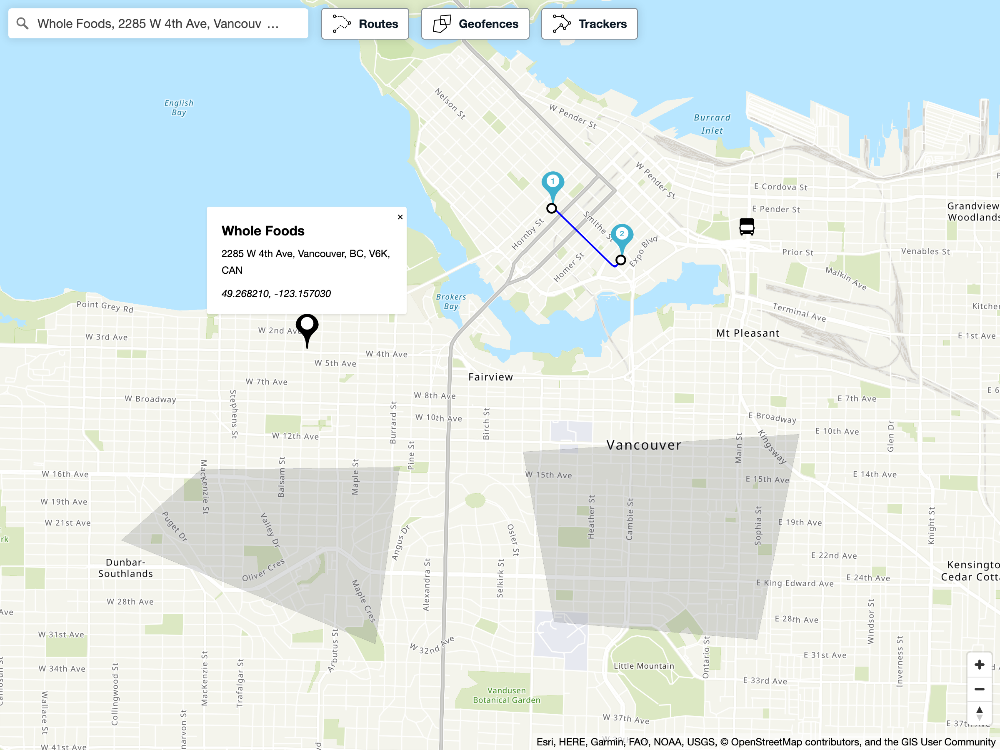

# Explore Sample

This sample app demonstrates the different Maps, Places, Routes, Geofences, and Trackers functionalities of Amazon Location Service. The sample primarily uses [Amplify UI Geo](https://ui.docs.amplify.aws/components/geo), [react-map-gl](https://visgl.github.io/react-map-gl/) and [Amazon Location Service](https://aws.amazon.com/location).

**Maps:** Allows you to visualize location information and is the foundation of the rest of the functionalities of the app.

**Places:** Allows you to search for a location and view the results on the map.

**Routes:** Allows you to calculate a route between two or more points. You will also be able to provide travel mode and departure time information as part of calculating a route.

**Geofences:** Allows you to view, create, and remove geofences from the map.

**Trackers:** Allows you to simulate device position updates, view tracked device positions, and view device position history on the map. If you want to see your own devices on the map, send position updates to the app's tracker resource by following [this guide](https://docs.aws.amazon.com/location/latest/developerguide/start-tracking.html).



## Implementation

See [`src/main.jsx`](src/main.jsx).

## Dependencies

[`@aws-amplify/ui-react`](https://ui.docs.amplify.aws/): Provides map and location search components from [Amplify UI Geo](https://ui.docs.amplify.aws/components/geo). Also used for styling throughout the app.

[`react-map-gl`](https://visgl.github.io/react-map-gl/): Provides map-related components. Also used by [Amplify UI Geo](https://ui.docs.amplify.aws/components/geo) to draw Amazon Location Service provided maps.

[`maplibre-gl-js`](https://github.com/maplibre/maplibre-gl-js): Used to draw Amazon Location Service provided maps through [react-map-gl](https://visgl.github.io/react-map-gl/) and [Amplify UI Geo](https://ui.docs.amplify.aws/components/geo).

[`aws-amplify`](https://github.com/aws-amplify/amplify-js): Helps with authentication to get resources from Amazon Location Service.

[`@aws-sdk`](https://github.com/aws/aws-sdk-js-v3): Used to make requests to Amazon Location Service.

[`@mapbox/mapbox-gl-draw`](https://github.com/mapbox/mapbox-gl-draw): Provides drawing capability to help create geofences.

See more in [`package.json`](package.json)

App has been tested on Node.js v16.13.2 and NPM v8.1.2

## Getting started

1. Install [`Node.js`](https://nodejs.org) (Note: Node.js is only used as part of the development environment).
2. Set up a map resource for Amazon Location Service by following [`this guide`](https://docs.aws.amazon.com/location/latest/developerguide/map-prerequisites.html#create-map-resource).
3. Set up a place index resource for Amazon Location Service by following [`this guide`](https://docs.aws.amazon.com/location/latest/developerguide/places-prerequisites.html#create-place-index-resource).
4. Set up a route calculator resource for Amazon Location Service by following [`this guide`](https://docs.aws.amazon.com/location/latest/developerguide/routes-prerequisites.html#create-route-calculator-resource).
5. Create an Amazon Cognito identity pool by following [`this guide`](https://docs.aws.amazon.com/location/latest/developerguide/how-to-access.html#authenticating-using-cognito).

   - The policy will need to contain the map and place index resources created.

     ```
     {
         "Version": "2012-10-17",
         "Statement": [
             {
                 "Sid": "Maps",
                 "Effect": "Allow",
                 "Action": [
                     "geo:GetMap*"
                 ],
                 "Resource": "arn:aws:geo:region:accountID:map/ExampleMap"
             },
             {
                 "Sid": "Places",
                 "Effect": "Allow",
                 "Action": [
                     "geo:SearchPlaceIndex*"
                 ],
                 "Resource": "arn:aws:geo:region:accountID:place-index/ExamplePlaceIndex"
             },
             {
                 "Sid": "Routes",
                 "Effect": "Allow",
                 "Action": [
                     "geo:CalculateRoute"
                 ],
                 "Resource": "arn:aws:geo:region:accountID:route-calculator/ExampleRouteCalculator"
             },
             {
                 "Sid": "Geofences",
                 "Effect": "Allow",
                 "Action": [
                     "geo:ListGeofences",
                     "geo:PutGeofence",
                     "geo:BatchDeleteGeofence"
                 ],
                 "Resource": "arn:aws:geo:region:accountID:geofence-collection/ExampleGeofenceCollection"
             },
             {
                 "Sid": "Trackers",
                 "Effect": "Allow",
                 "Action": [
                     "geo:ListDevicePositions",
                     "geo:BatchUpdateDevicePosition",
                     "geo:GetDevicePositionHistory"
                 ],
                 "Resource": "arn:aws:geo:region:accountID:tracker/ExampleTracker"
             }
         ]
     }
     ```

6. Install project dependencies: run `npm install` from the sample app location on your computer.
7. Fill in required fields for Amazon Cognito and Amazon Location Service in [`src/configuration.js`](src/configuration.js).
8. Start the app: run `npm start` from the sample app location on your computer.

## Important notes

- You may see the following AuthError in your browser's developer console:

  ```
  AuthError -
  Error: Amplify has not been configured correctly.
  The configuration object is missing required auth properties.
  This error is typically caused by one of the following scenarios:

  1. Did you run `amplify push` after adding auth via `amplify add auth`?
      See https://aws-amplify.github.io/docs/js/authentication#amplify-project-setup for more information

  2. This could also be caused by multiple conflicting versions of amplify packages, see (https://docs.amplify.aws/lib/troubleshooting/upgrading/q/platform/js) for help upgrading Amplify packages.
  ```

  This is currently a [known issue](https://github.com/aws-amplify/amplify-js/issues/9845) in the Amplify Auth library that is requiring an Amazon Cognito user pool to be configured. Since this app is set up to allow unauthenticated identities, no user pool is needed. This does not affect the behaviour of the app other than the error appearing in the console.

## Security

See [CONTRIBUTING](../CONTRIBUTING.md#security-issue-notifications) for more information.

## License

This library is licensed under the MIT-0 License. See the LICENSE file.
