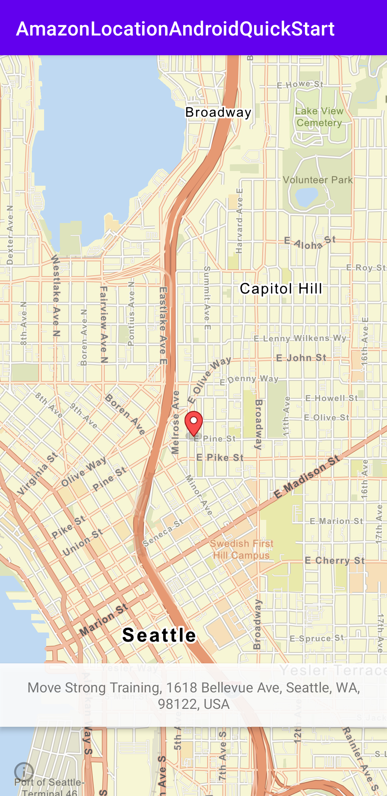

# Quickstart: Create an Android app with Amazon Location Maps and Places API

This quickstart app creates a quick start application that demonstrates the following:

1. Adding Amazon Location Maps using Esri as data source to the app.
2. Adding reverse geocoding using Amazon Location Places API to demonstrate a place picker.

After a successful build the app will look like:



## Prerequisities
1. A Amazon Location map resource
1. A Amazon Location place-index resource
1. A Cognito identity pool for unauthorized access

## How to set up the project
Before the project can be built we need the following steps to be completed:
1. Configuring amplify to set map, place-index, and cognito identity-pool id.
1. Setting up Android SDK path using `local.properties` file or opening the project in Android Studio.

### Configuring Amplify
This project uses a JSON configuration following Amplify's configuration schema in `app/res/raw/amplifyconfiguration.json`. To use the quick start, we need to replace the following in the configuration JSON.
1. [region]
1. [map name]
1. [map style name]
1. [place index name]

For example, if we are building this application for region `us-west-2`, map resource name `sample-map`, map style name `VectorEsriStreets`, place-index resource name `sample-place-index`, and cognito pool id `us-west-2:cognito-pool-id`, `amplifyconfiguration.json` will look like the following:

```json
{
  "UserAgent": "aws-amplify-cli/2.0",
  "Version": "1.0",
  "geo": {
    "plugins": {
      "awsLocationGeoPlugin": {
        "region": "us-west-2",
        "maps": {
          "items": {
            "sample-map": {
              "style": "VectorEsriStreets"
            }
          },
          "default": "sample-map"
        },
        "searchIndices": {
          "items": [
            "sample-place-index"
          ],
          "default": "sample-place-index"
        }
      }
    }
  },
  "auth": {
    "plugins": {
      "awsCognitoAuthPlugin": {
        "UserAgent": "aws-amplify-cli/0.1.0",
        "Version": "0.1.0",
        "IdentityManager": {
          "Default": {}
        },
        "CredentialsProvider": {
          "CognitoIdentity": {
            "Default": {
              "PoolId": "us-west-2:cognito-pool-id",
              "Region": "us-west-2"
            }
          }
        }
      }
    }
  }
}

```

### Setting up Android SDK path
This step is only necessary if the project is to be built without Android Studio. Opening the project in Android Studio will automatically create a `local.properties` file with configured Android SDK.

To create the `local.properties` file manually, we need to produce a configuration as below:

```properties
sdk.dir=/Users/[your_username]/Library/Android/sdk
```
### Building the Android project
If not used inside Android SDK, running `./gradlew build` will initiate a gradle build task to build the project.