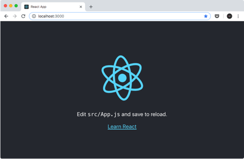
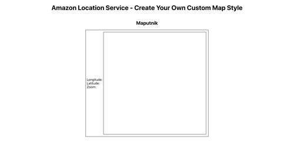
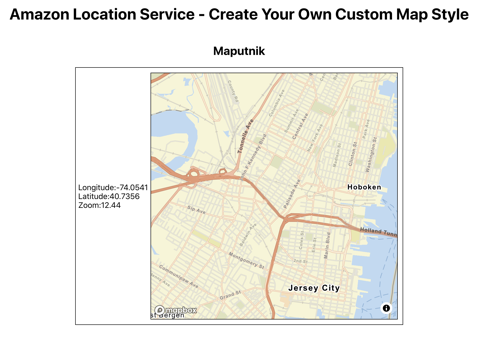
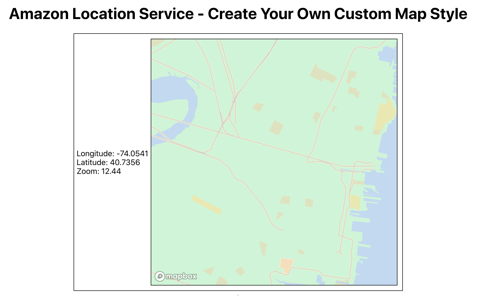

# Amazon Location Service - Create a custom map style

[Amazon Location Service (ALS)](https://aws.amazon.com/location/) is a managed AWS service for adding location data to applications. It currently has two data providers, [Esri](https://aws.amazon.com/location/data-providers/esri/) and [HERE](https://aws.amazon.com/location/data-providers/here-technologies/), as well as six default map styles. What happens if you want to change the colors of your map to meet your brand or visual design?

This is particularly valuable if a map is a big part of your product flow or when a map is displayed in a location that should fit in well to the rest of the page. The following walk through will demonstrate how this is possible.

There are are various open source options for changing the style of a map, one of which we will demonstrate [Maputnik](https://maputnik.github.io/). In order to style our existing map we will run a local proxy that handles AWS [SigV4](https://docs.aws.amazon.com/general/latest/gr/signature-version-4.html) request signing to serve tiles to Maputnik out of the box.

The following README provides multiple options to learn how to change your map's default style. To learn how to integrate it into a standard React web application you can follow either [Option #1](##option-1-use-this-pre-built-app) to use the pre-built app in this repo or [Option #2](##option-2-start-from-scratch) to start from scratch. If you just want to know how to edit an existing AWS Location Service map style, you can skip to the [Styling a Custom Map section](##styling-a-custom-map).
  
## Prerequisites

1. In your terminal create a workspace

    ```bash

    mkdir blog
    cd blog
    ```

1. Install [NVM](https://github.com/nvm-sh/nvm#installing-and-updating) (installed per-user, and invoked per-shell) OR Install [Node.js](https://nodejs.org/en/download/) directly
1. Install the [AWS-CLI V2](https://docs.aws.amazon.com/cli/latest/userguide/install-cliv2.html)
1. Install [Amplify](https://docs.amplify.aws/cli/start/install) (Note: If you have a local environment that uses several AWS accounts be sure to use the correct AWS CLI profile and log in to the correct account in the browser)
1. This walk-through uses **"Amplify-Default"** as the AWS CLI profile name and **"us-west-2"** as the AWS Region. Feel free to substitute these values.

## Option 1 Use this Pre Built App

1. Clone this repo:

     ```bash
     https://github.com/aws-samples/amazon-location-samples.git
     cd create-custom-map-style
     ```

1. Checkout Node version 12

    ```bash

    nvm install 12
    nvm use 12
    ```

 This allows you to use version 12 locally without setting a specific version globally (although you can install global packages *for that particular* version)

1. Install the application dependencies

    ```bash
    
    npm install
    ```

1. Configure Amplify environment `amplify configure`
 You will be prompted with the following:

    ```bash
 
    Follow these steps to set up access to your AWS account:

    Sign in to your AWS administrator account:
    https://console.aws.amazon.com/
    Press Enter to continue

    Specify the AWS Region
    ? region:  us-west-2
    Specify the username of the new IAM user:
    ? user name:  amplify-xxXXx
    Complete the user creation using the AWS console
    https://console.aws.amazon.com/iam/home?region=us-west-2#/users$new?step=final&accessKey&userNames=amplify-xxXXx&permissionType=policies&policies=arn:aws:iam::aws:policy%2FAdministratorAccess
    Press Enter to continue

    Enter the access key of the newly created user:
    ? accessKeyId:  ********************
    ? secretAccessKey:  ****************************************
    This would update/create the AWS Profile in your local machine
    ? Profile Name:  Amplify-Default

    Successfully set up the new user.
    ```

 NOTE: If you give the Profile Name as `Amplify-Default` as shown above you can substitute it for `<YOUR AWS CLI PROFILE>` in the following steps.

1. Initialize your application `amplify init`

    ```bash

    ? Do you want to use an existing environment? No
    ? Enter a name for the environment <YOUR ENVIRONMENT NAME>
    Using default provider  awscloudformation
    ? Select the authentication method you want to use: AWS profile

    For more information on AWS Profiles, see:
    https://docs.aws.amazon.com/cli/latest/userguide/cli-configure-profiles.html

    ? Please choose the profile you want to use Amplify-Default
    Adding backend environment <YOUR ENVIRONMENT NAME> to AWS Amplify Console app:
    ....
    ```

1. Run `$ amplify status` to see what will be provisioned

    ```bash

    Current Environment: <YOUR ENVIRONMENT NAME>

    | Category | Resource name                | Operation | Provider plugin   |
    | -------- | ---------------------------- | --------- | ----------------- |
    | Hosting  | S3AndCloudFront              | No Change | awscloudformation |
    | Auth     | createcustommapstyle0000000x | No Change | awscloudformation |
    | Geo      | CreateCustomMapStyle         | No Change | awscloudformation |
    ```

1. Push your backend to the cloud `amplify push` - It will create all the resources in the cloud

    ```bash

    ✔ Successfully pulled backend environment <YOUR ENVIRONMENT NAME> from the cloud.
    
    Current Environment: <YOUR ENVIRONMENT NAME>

    | Category | Resource name                | Operation | Provider plugin   |
    | -------- | ---------------------------- | --------- | ----------------- |
    | Hosting  | S3AndCloudFront              | Create    | awscloudformation |
    | Auth     | createcustommapstyle0000000x | Create    | awscloudformation |
    | Geo      | CreateCustomMapStyle         | Create    | awscloudformation |
    
    ? Are you sure you want to continue? Yes
    ⠋ Updating resources in the cloud. This may take a few minutes..
    ```

1. Wait for Cloudformation to provision the necessary resources. Once it's done you should get a message like this:

    ```bash

    ✔ All resources are updated in the cloud
    ```

1. The React App can then be run with `npm start` and the deployed app can be updated with `amplify publish` whenever you like. Skip to
[*Creating Amazon Location Service Resources*](#creating-amazon-location-service-resources) in this README to continue.

## Option 2 Start from Scratch

### Create a new React app

1. Install and use Node v12

    ```bash

    nvm install 12 
    nvm use 12
    ```

1. From your workspace run

    ```bash

    npx create-react-app create-custom-map-style 
    cd create-custom-map-style
    ```

 This will create a new React desktop application for you

### Amplify Setup

1. Follow the instructions to initialize a new Amplify project [as outlined here](https://docs.amplify.aws/cli/start/workflows#initialize-new-project)

1. For the prompts enter the following:

  ```bash

    $ amplify init
    
    Note: It is recommended to run this command from the root of your app directory
    ? Enter a name for the project createcustommapstyle
    ? Enter a name for the environment <YOUR ENVIRONMENT NAME>
    ? Choose your default editor: Visual Studio Code # (or whatever editor you prefer)
    ? Choose the type of app that you\'re building javascript
    Please tell us about your project
    ? What javascript framework are you using react
    ? Source Directory Path:  src
    ? Distribution Directory Path: build
    ? Build Command:  npm run-script build
    ? Start Command: npm run-script start
    Using default provider awscloudformation

    For more information on AWS Profiles, see:
    https://docs.aws.amazon.com/cli/latest/userguide/cli-multiple-profiles.html

    ? Do you want to use an AWS profile? Yes
    ? Please choose the profile you want to use  Amplify-Default
  ```

1. That leaves us with a root stack for our Amplify project in CloudFormation, now let's add the `Auth` category:

    ```bash

    $ amplify add auth
    Using service: Cognito, provided by: awscloudformation

    The current configured provider is Amazon Cognito.

    Do you want to use the default authentication and security configuration? Default configuration
    Warning: you will not be able to edit these selections.
    How do you want users to be able to sign in? Email
    Do you want to configure advanced settings? No, I am done.
    Successfully added auth resource createcustommapstyle0000000x locally

    Some next steps:
    "amplify push" will build all your local backend resources and provision it in the cloud
    "amplify publish" will build all your local backend and frontend resources (if you have 
    hosting category added) and provision it in the cloud
    ```

 (Note: `createcustommapstyle0000000x` will always include a UUID generated by Amplify so substitute it for yours in the following steps)

1. The new resources have only been configured in our local environment so let's publish them to our AWS Account:

    ```bash

    $ amplify push
    
    | Category | Resource name                | Operation | Provider plugin   |
    | -------- | ---------------------------- | --------- | ----------------- |
    | Auth     | createcustommapstyle0000000x | Create    | awscloudformation |
    ? Are you sure you want to continue? Yes
    ```

1. Should you get an __error__ like this:

    ```bash

    CREATE_FAILED UserPoolClientLambda                                  AWS::Lambda::Function
          
    Mon Jan 00 2021 00:00:00 GMT-0000 (Eastern Daylight Time) The runtime parameter of 
    nodejs6.10 is no longer supported for creating or updating AWS Lambda functions. 
    We recommend you use the new runtime (nodejs12.x) while creating or updating functions.
    ```

    You can either update your version of the Amplify CLI and start over or you can manually edit the CloudFormation template generated by Amplify to replace all occurrences of `nodejs6.10` with `nodejs12` either in our IDE or with the command line as shown below:

    ```bash

    cd ~/<PATH TO YOUR SOURCE CODE>/blog/create-custom-map-style/amplify/backend/auth/cognito0cc0c000
    sed -e 's/nodejs6.10/nodejs12.x/g' -i.copy cognito0cc0c000-cloudformation-template.yml
    rm *.copy
    cd ../../../../
    amplify push
    ```

1. After the Auth resource are created you should notice an auto-generated `aws-exports.js` in your project's `src` directory

1. Next we're going to install and add the Geo category through the Amplify CLI

    ```bash
    $ npm i -g @aws-amplify/cli@geo
    $ amplify add geo

    Amplify Geo category is in developer preview and not intended for production use at this time.
    ? Select which capability you want to add: Map (visualize the geospatial data)
    ? Provide a name for the Map: CreateCustomMapStyle 
    # or whatever name you prefer, just substitute in the following steps
    ? Who can access this Map? Authorized users only
    The following choices determine the pricing plan for Geo resources. Learn more at https://aws.amazon.com/location/pricing/
    ? Are you tracking commercial assets for your business in your app? No, I only need to track consumer
    s personal mobile devices
    Successfully set RequestBasedUsage pricing plan for your Geo resources.
    Available advanced settings:
    - Map style & Map data provider (default: Streets provided by Esri)

    ? Do you want to configure advanced settings? Yes
    ? Specify the map style. Refer https://docs.aws.amazon.com/location-maps/latest/APIReference/API_MapConfiguration.html Streets (data provided by Esri)
    Successfully added resource CreateCustomMapStyle locally.

    Next steps:
    "amplify push" builds all of your local backend resources and provisions them in the cloud
    "amplify publish" builds all of your local backend and front-end resources (if you added hosting category) and provisions them in the cloud
    ```

1. We have more resources to publish to our AWS Account, so again we'll run the following:

    ```bash

    $ amplify push

    ✔ Successfully pulled backend environment <YOUR ENVIRONMENT NAME> from the cloud.

    Current Environment: <YOUR ENVIRONMENT NAME>

    | Category | Resource name                | Operation | Provider plugin   |
    | -------- | ---------------------------- | --------- | ----------------- |
    | Geo      | CreateCustomMapStyle         | Create    | awscloudformation |
    | Auth     | createcustommapstyle0000000x | No Change | awscloudformation |
    ? Are you sure you want to continue? Yes
    ⠹ Updating resources in the cloud. This may take a few minutes...
    ...
    ✔ All resources are updated in the cloud
    ```

    1. This step created our Map Resource through Amplify. We will use this map to create our new style.

    1. If you would like to check out how it looks currently, navigate to [AWS Location Services Console](https://console.aws.amazon.com/location/home) and check under "Maps".

    1. We are using Esri Street Map as our base map style. This comprehensive street map includes highways, major roads, minor roads, railways, water features, cities, parks, landmarks, building footprints, and administrative boundaries.

### React-Amplify Integration

1. Now that we've set up all the Authorization infrastructure needed for our application, we can test it out with our frontend React application. To start we need to add the `aws-amplify` package to our dependencies

    ```bash

    npm i aws-amplify
    ```

1. Open `src/index.js` in your IDE

1. Under your existing list of import statements create a new line and add the following:

    ```js

    ...
    import  Amplify  from  "aws-amplify";
    import  awsExports  from  "./aws-exports";
    ```

1. Next we'll need to configure our Amplify so above the `ReactDOM.render` line let's add the following:

    ```js

    ...
    Amplify.configure(awsExports);
    ...
    ```

 The `configure()` method is just setting the AWS resources that we want to use for our backend. It might look intimidating, but just remember this isn’t doing anything special here beside configuration.

1. At this point your `src/index.js` file should something like this:

    ```js
    import  React  from  'react';
    import  ReactDOM  from  'react-dom';
    import  './index.css';
    import  App  from  './App';
    import  reportWebVitals  from  './reportWebVitals';
    import  Amplify  from  'aws-amplify';
    import  awsExports  from  './aws-exports';

    Amplify.configure(awsExports);
    
    ReactDOM.render(
      <React.StrictMode>
        <App  />
      </React.StrictMode>,
      document.getElementById('root')
    );


    // If you want to start measuring performance in your app, pass a function
    // to log results (for example: reportWebVitals(console.log))
    // or send to an analytics endpoint. Learn more: https://bit.ly/CRA-vitals
    reportWebVitals();
    ```

1. After configuring Amplify at the React application's top-level module it can be used in child components. In our particular case this is only `App.js`

1. Before we proceed we will need to bring in a few more dependencies, in your terminal run the following commands:

    ```bash
    npm i @aws-amplify/ui-react
    ```

1. Open `src/App.js` in your IDE. Under your existing list of existing import statements create a new line and add the following:

    ```js
    ...
    import { withAuthenticator } from  '@aws-amplify/ui-react';
    ```

1. Replace your module export line - `export default App;` - with the following:

    ```js
    export default withAuthenticator(App);
    ```

1. Amplify's React library provides an extremely useful higher order component to provide authentication for your app. By simply wrapping your application's existing code in this one component you now have a complete authentication flow (login/logout)

1. To test out your app's new login screen open your terminal and start the react app:

    ```bash
    npm start
    ```

 You should see a login screen as shown below. Being that this is the first time you are running the app with authentication you will need to create a new account to login

 
 *The Cognito Hosted UI Login Screen*

1. Once you've created a new account and logged in you should be presented with the default React app UI

 
 *The create react app default screen*

### Creating a Map UI view

 1. To create this view we'll start with the HTML / CSS skeleton before adding the business logic with JS. I've renamed my `App` component (`src/App.js` and `src/App.css`) to `SamplePage`, but you can feel free to keep the name `App.js`. Open this file in your IDE.

 1. Inside the `return` statement we're going to erase everything and start from scratch. At the root we're going to start with a simple `div` element with a `class` attribute of `sample-page`. Your functional component should look something like this:

    ```js
    function SamplePage() {
      return (
        <div className="sample-page">
          
        </div>
      );
    }
    ```

 1. Next we'll add in some sample content, a level one header with the title of the page:

    ```html
    <div className="sample-page">
      <h1>Amazon Location Service - Create Your Own Custom Map Style</h1>
    </div>
    ```

 1. Then we'll add a container for the kind of map we're going to demo

    ```js
    // Below h1
    ...
      <div className="map-container">
    
      </div>
    ...
    ```

 1. Inside the container we'll give it a `sidebar` and a `map` div

    ```js
    ...
    <div className="map-container">
      <div className="demo-sidebar">
      <div>
        Longitude: 
        <br />
        Latitude:
        <br />
        Zoom:
        <br />
      </div>  
      </div>
      <div className="demo-map" />
    </div>
    ...
    ```

 1. The page now needs some styling so in `src/SamplePage.css` remove the existing styling and add the following:

    ```css
    .sample-page {
      display: flex;
      justify-content: center;
      align-items: center;
      flex-direction: column;
    }
    
    .map-container {
      display: flex;
          justify-content: center;
      align-items: center;
      border: 0.25px  solid  black;
      padding: 5px;
    }
    
    .demo-map {
      height: 500px;
      width: 500px;
      border: 0.25px  solid  black;
      margin: 5px;
    }
    ```

 1. Be sure to import your CSS in the `SamplePage` component:

    ```js
    import  './SamplePage.css'
    ```

 1. Your page should look like this now:

 
 *App Skeleton*

### React - Amazon Location Service Integration

1. Now it's time for adding yet another package; this time a very important library that uses WebGL to render interactive maps from [vector tiles](https://docs.mapbox.com/help/glossary/vector-tiles/) and [Maplibre styles](https://maplibre.org/maplibre-gl-js-docs/style-spec/)

    ```bash

    npm install maplibre-gl --save
    ```

1. With this we'll start adding the map to our page. Start by importing the dependencies in your `SamplePage` component

    ```js

    ...
    import maplibregl from 'maplibre-gl';
    ...
    ```

1. Here's where we'll get a chance to fire up our react hooks. We need to add a reference (`useRef`) to the `.demo-map` DOM node, make an asynchronous API call (`useEffect`) to fetch data using Amplify, and keep track of the latitude, longitude, and zoom level of the map (`useState`)

    ```js

    ...
    import  React, { useRef, useState, useEffect } from  'react';
    import { Auth } from  'aws-amplify';
    ...
    const  SamplePage = () => {
      const  map = useRef();
      const [coordinates, setCoordinates] = useState({
      lat:  40.7356,
      lng: -74.0541,
      zoom:  12.44,
      });
      useEffect(async () => {
      const  credentials = await  Auth.currentCredentials();
      const { lat, lng, zoom } = coordinates;
      const  demoMap = new  mapboxgl.Map({
        container:  map.current,
        center: { lng, lat },
        zoom,
        style:  'http://localhost:3000/example-style-descriptor.json',
        transformRequest:  transformRequest(credentials),
      });
      demoMap.on('move', () => {
        setCoordinates({
          lng:  demoMap.getCenter().lng.toFixed(4),
          lat:  demoMap.getCenter().lat.toFixed(4),
          zoom:  demoMap.getZoom().toFixed(2),
        });
      });
      return () =>  demoMap.remove();
      }, []);
    })
    ...

    // And in your return statement below change
    // <div className="demo-map" />
    // to

    <div ref={map} className="demo-map" />
    ```

1. You may notice that we're calling a `transformRequest` function in the constructor for the map. We'll need to add this now. Create a new file in the `src` directory called `transformRequest.js` and paste the following:

    ```js

    import { Signer } from  '@aws-amplify/core';

    export  default (credentials) => (url, resourceType) => {
      if (resourceType === "Style" && !url.includes("://")) {
      url = `https://maps.geo.us-west-2.amazonaws.com/maps/v0/maps/${url}/style-descriptor`;
      }
      if (url.includes("amazonaws.com")) {
      return {
        url:  getSignedUrl(url, credentials),
      };
      }
      return {
      url
      };
    }

    export  const  getSignedUrl = (url, credentials) => {
      return  Signer.signUrl(url, {
      access_key:  credentials.accessKeyId,
      secret_key:  credentials.secretAccessKey,
      session_token:  credentials.sessionToken,
      });
    }
    ```

1. Be sure to import the function in your `SamplePage` component
1. You should be able to go back to your browser now and see the base map style show up inside your `demo-map` div

 
 *Esri Streets Base Map*

## Styling a Custom Map

1. Maputnik is an open source visual editor for the [Mapbox Style Specification](https://www.mapbox.com/mapbox-gl-js/style-spec). At the time of writing this editor can be either used in the browser or downloaded as a binary and can run locally. We are going to use the latter option.
1. Go to <https://github.com/maputnik/editor/wiki/Maputnik-CLI> and follow the instructions for installation or optionally from your terminal:

    ```bash

    wget <https://github.com/maputnik/editor/releases/download/latest/maputnik-darwin.zip>
    unzip maputnik-darwin.zip
    chmod 755 maputnik
    ```

1. Start up Maputnik

    ```bash

    ./maputnik
    ```

 And open your browser to <http://localhost:8000/#12.44/40.7356/-74.0541>

1. It would be best to start with a clean canvas. Click "Open" in the top navigation bar, then scroll down to the bottom of "Gallery Styles" and selected "Empty Style".

 
 *Open A Style*

 
 *Empty Canvas*

1. Tessera is a pluggable [map tile](https://en.wikipedia.org/wiki/Tiled_web_map) server. Using the power of the [tilelive](https://github.com/mapbox/tilelive) ecosystem, it is capable of serving and rendering map tiles from many sources. To stream data from most sources you can install the tilelive providers as npm packages. For an Amazon Location Service source we use tilelive-aws.
1. From your terminal run

    ```bash

    mkdir tileserver
    cd tileserver
    ```

1. We'll need to init a new node project in the current directory

    ```bash

    $ npm init --yes

    Wrote to ... /create-custom-map-style/tileserver/package.json:

    {
      "name": "tileserver",
      "version": "1.0.0",
      "description": "",
      "main": "index.js",
      "scripts": {
        "test": "echo \"Error: no test specified\" && exit 1"
      },
      "keywords": [],
      "author": "",
      "license": "ISC"
    }
    ```

1. Next we need to add the Amazon Location Service API as a data source. However, in order to do this we need to use a local proxy that can handle SigV4 (TL;DR a way to provide your AWS credentials with http requests). For this we will use [tessera](https://github.com/mojodna/tessera) and [tilelive-aws](https://github.com/beatleboy501/tilelive-aws). From a new terminal (the `maputnik` process will be occupying the other terminal) run the following:

    ```bash

    nvm use 12
    npm i tessera tilelive-aws aws4
    ```

1. The module makes use of several environment variables to be able to sign calls to the AWS API. You can run the following to generate the required AWS credentials:

    ```bash

    $ aws sts get-session-token --duration-seconds 36000 --profile Amplify-Default

    {
      "Credentials": {
        "AccessKeyId": "XXXX0XX0X0XXXXXX0XXX",
        "SecretAccessKey": "x0XXxxXXXxXxXX0xXxxX0XXxX0X0xxxx0XxxxxXX",
        "SessionToken": "XXxXx0XXxX0xxX0XxXXx//////////....=",
        "Expiration": "2021-00-00T00:00:00+00:00"
      }
    }
    ```

    Set these environment variables in your terminal like so:

    ```bash

    export AWS_ACCESS_KEY_ID=<Access Key from Previous Step>
    export AWS_SECRET_ACCESS_KEY=<Secret Key from Previous Step>
    export AWS_SESSION_TOKEN=<Session Token from Previous Step>
    ```

    or optionally run the helper script we've included (be sure to have jq installed first, `brew install jq` on Mac, or follow instructions for other platforms here: <https://stedolan.github.io/jq/download/>):
    `./setAwsEnvVariables.sh Amplify-Default`

1. This should be enough to get started using `tessera`. You'll need to provide the full file path to your module, so from your terminal run:

    ```bash

    npx tessera -r $(pwd)/node_modules/tilelive-aws/tilelive-aws.js aws:///CreateCustomMapStyle-<YOUR ENVIRONMENT NAME>
    ```

1. You should see some output in sdtout like `Listening at http://0.0.0.0:8080`.

1. Now go back to Maputnik in your browser and click "Data Sources" in the top navigation bar. There should not be any active data sources. If you see any be sure to delete them.

 
 *Data Sources*

1. We're going to add a new data source as shown below.

- `Source ID`: `amazon`
- `Source Type`: `Vector (XYZ URLs)`
- `1st Tile URL`: `http://localhost:8080/{z}/{x}/{y}@2x.png`
- `Min Zoom`: `0`
- `Max Zoom`: `22`

 
 *New Data Source*

1. In addition to Tiles, the type of web map we will be styling also makes use of Glyphs and Sprites. We can't use Tessera to proxy the endpoints for these, but we can however generate a signed URL for each endpoint to stick in our style descriptor JSON file.

  (Optionally, we can choose to cheat and skip this step by providing some out of the box endpoints built in to Maputnik. Sprites: `https://maputnik.github.io/osm-liberty/sprites/osm-liberty` and Glyphs: `https://api.maptiler.com/fonts/{fontstack}/{range}.pbf?key={key}`)

1. If you want to download a copy of the Sprites and Glyphs your map uses we've included a helper script `downloadSpritesGlyphs.sh` :

    ```bash
    ./downloadSpritesGlyphs.sh CreateCustomMapStyle-<YOUR ENVIRONMENT NAME> Amplify-Default
    ```
  
This should create a folder for `sprites` and a folder for `glyphs` with a number of options for each. [Sprites](https://docs.aws.amazon.com/cli/latest/reference/location/get-map-sprites.html) can be either .json or .png files with an optional @2x version. [Glyphs](https://docs.aws.amazon.com/cli/latest/reference/location/get-map-glyphs.html) are a combination of a font and a Unicode range.

1. If you choose to download the map Glyphs and Sprites you'll have to serve them on a port that is not already occupied. From `tileserver/`:

    ```bash
    npx http-server . -p 8088
    ```

1. While we could start from scratch to style the map it is easier to demonstrate with a starter template taken from our map style. Click "Open" in the top navigation bar and under "Upload Style" click "Upload" and select the `example-style-descriptor.json` file included in this repo.

1. This is the style descriptor that is provided by Amazon Location Service as part of your Esri Map. You can download this JSON file by making a signed request to the API endpoint, i.e.

    ```bash

    aws location get-map-style-descriptor --map-name CreateCustomMapStyle style-descriptor.json --profile <YOUR AWS PROFILE NAME>
    ```

 We recommend using a SigV4 request-signing library such as [aws4](https://github.com/mhart/aws4#example).

1. Because we are proxying our map tiles through a local tileserver we'll need to change one line in the descriptor JSON to point to the correct endpoint. (We'll change it back later).

1. Change Line 7
  From

    ```json

    "tiles": ["https://maps.geo.us-west-2.amazonaws.com/maps/v0/maps/CreateCustomMapStyle/tiles/{z}/{x}/{y}"],
    ```

    To

    ```json

    "tiles": ["http://localhost:8080/{z}/{x}/{y}@2x.png"],
    ```

1. If you see an `AccessDenied` error in the `tessera` terminal you may need to manually update the IAM permissions for your role/user add action `geo:GetMapTile` on resource: `arn:aws:geo:<REGION>:<ACCOUNT>:map/CreateCustomMapStyle-<YOUR ENVIRONMENT NAME>`.

1. From the "*View*" dropdown let's select "*Map*"

1. Now we should see a list of layers appear on the left side of the screen

 
 *List of Layers*

1. Let's select the `Building/fill` Layer

 
 *The Land/Not ice Layer*

1. Scroll down to the JSON Editor section on the left navigation panel

 
 *The JSON Editor*

1. Note that its fill color is `#f7f6d5`, let's change it to something funky like `#EE84D9`

  
  *Layer Before*

  
  *Layer After*

1. Now you can see how the map's style has changed a little, you play around some more by clicking on certain areas of the map and seeing which layer it corresponds. Feel free to change colors or outlines

## Map Styling Tips

To help you with your map styling decisions, here are some handy tips:

- Learn the MapLibre style document specification <https://maplibre.org/maplibre-gl-js-docs/style-spec/>
- Learn hexadecimal color values and pick a palette of colors
- Add map accessibility when needed (i.e. color-blind awareness)
- Plan for map markers and choose colors that will contrast
- Use gradients and color transparency for greater detail
- Reserve blue for water layers only
- Ensure legible text values by choosing the best label background and text halo

## Publishing and Using Your Custom Maputnik Map

1. Once you're satisfied with the changes you've made to the map style, the next step is to export and bundle the style JSON with your frontend assets
  
1. On your Maputnik tab in the browser, click "Export" in the top navigation bar
  
1. You should save the file as `example-file-descriptor.json` and place it back in your project's `public/` directory
  
1. Remember to change back Line 7
 From

    ```json

    "tiles": ["http://localhost:8080/{z}/{x}/{y}@2x.png"],
    ```

    To

    ```json

    "tiles": ["https://maps.geo.us-west-2.amazonaws.com/maps/v0/maps/CreateCustomMapStyle-<ENVIRONMENT NAME>/tiles/{z}/{x}/{y}"],
    ```

1. We can change the background color of the `.map-container` selector to something like `#EE84D955` to see how the map style changes can be used to match the branding of the rest of a page. In your browser you can now refresh and see the changes you made in Maputnik show up in your own page.
  
   
   *Changes Appear*

### Deployment (Optional)

1. Once you are happy with the edits to the page you can add hosting and see these changes live on the web fairly easily with one additional step.

1. From your terminal `cd` to the root directory and run:

    ```bash
    $ amplify add hosting
    ? Select the plugin module to execute Amazon CloudFront and S3
    ? Select the environment setup: DEV (S3 only with HTTP)
    ? hosting bucket name createcustommapstyle-<YOUR ENVIRONMENT NAME>-hostingbucket
    ? index doc for the website index.html
    ? error doc for the website index.html

    $ amplify publish
    ✔ Successfully pulled backend environment <YOUR ENVIRONMENT> from the cloud.

    Current Environment: <YOUR ENVIRONMENT NAME>

    | Category | Resource name                | Operation | Provider plugin   |
    | -------- | ---------------------------- | --------- | ----------------- |
    | Hosting  | S3AndCloudFront              | Create    | awscloudformation |
    | Auth     | createcustommapstyle5982835e | No Change | awscloudformation |
    | Geo      | CreateCustomMapStyle         | No Change | awscloudformation |
    ? Are you sure you want to continue? Yes
    ⠴ Updating resources in the cloud. This may take a few minutes...
    ...
    ✔ All resources are updated in the cloud

    Hosting endpoint: http://createcustommapstyle-<YOUR ENVIRONMENT NAME>-hostingbucket-<YOUR ENVIRONMENT NAME>.s3-website-us-west-2.amazonaws.com
    ...
    Creating an optimized production build...
    Compiled successfully.
    ...
    ✔ Uploaded files successfully.
    Your app is published successfully.
    http://createcustommapstyle-<YOUR ENVIRONMENT NAME>-hostingbucket-<YOUR ENVIRONMENT NAME>.s3-website-us-west-2.amazonaws.com
    ```

1. Click on the link provided by Amplify CLI and you can now see and share a URL with the customized page and web map we have built in this walk-through.

## Teardown

The teardown is relatively easy with the Amplify CLI here's how we can do it with two short steps

1. From the root directory of your project run `amplify status` to see what stacks exist currently

    ```bash

    $ amplify status
    
    Current Environment: <YOUR ENVIRONMENT NAME>

    | Category | Resource name                | Operation | Provider plugin   |
    | -------- | ---------------------------- | --------- | ----------------- |
    | Hosting  | S3AndCloudFront              | No Change | awscloudformation |
    | Auth     | createcustommapstyle0000000x | No Change | awscloudformation |
    | Geo      | CreateCustomMapStyle         | No Change | awscloudformation |

    ```

1. To delete everything simply run `amplify delete`

    ```bash

      $ amplify delete

      ? Are you sure you want to continue? This CANNOT be undone. (This will delete
      all the environments of the project from the cloud and wipe out all the loca
      l files created by Amplify CLI) Yes
      ⠋ Deleting resources from the cloud. This may take a few minutes...
      Deleting env:<YOUR ENVIRONMENT NAME>
      ✔ Project deleted in the cloud
      Project deleted locally.
    ```

## Conclusion

Using Amazon Location Service with other AWS Services and Maputnik/ MapLibre GL JS which are an open source, you can create a fully customizable Map style especially when maps are an integral part of your application and you want to give your maps a personalized touch
