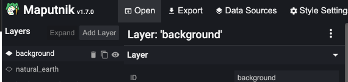
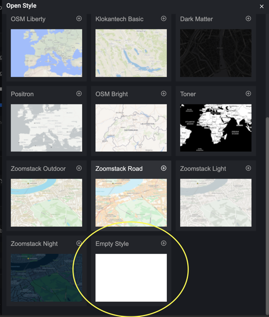
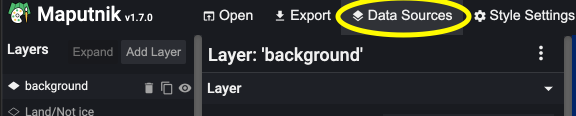
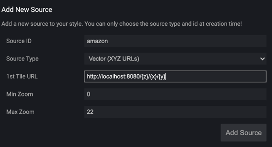
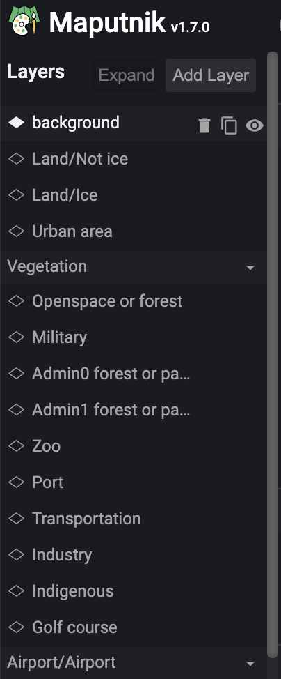
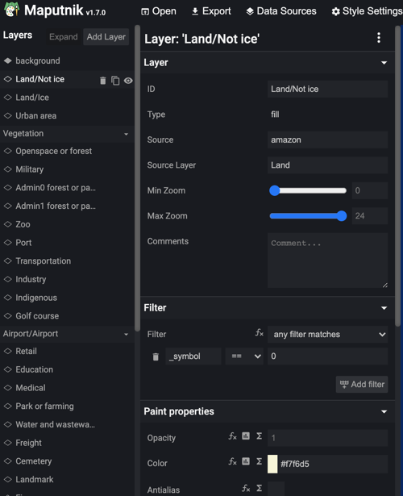
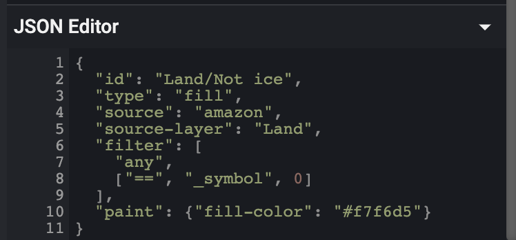
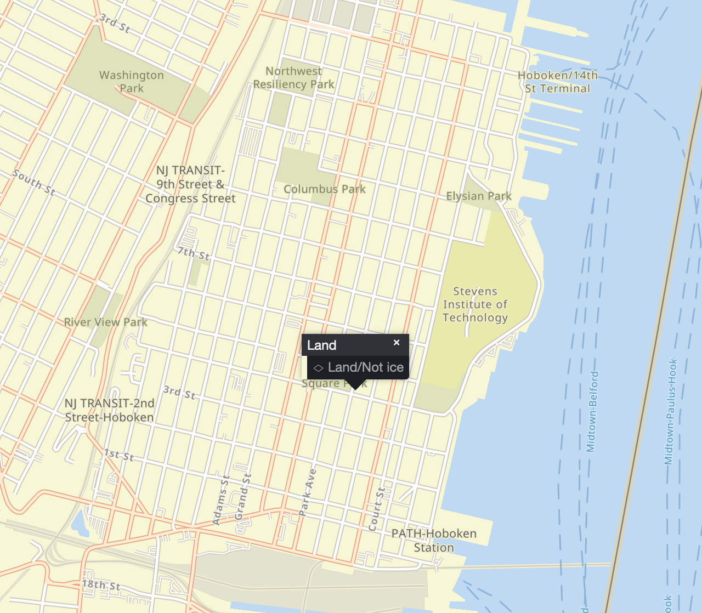
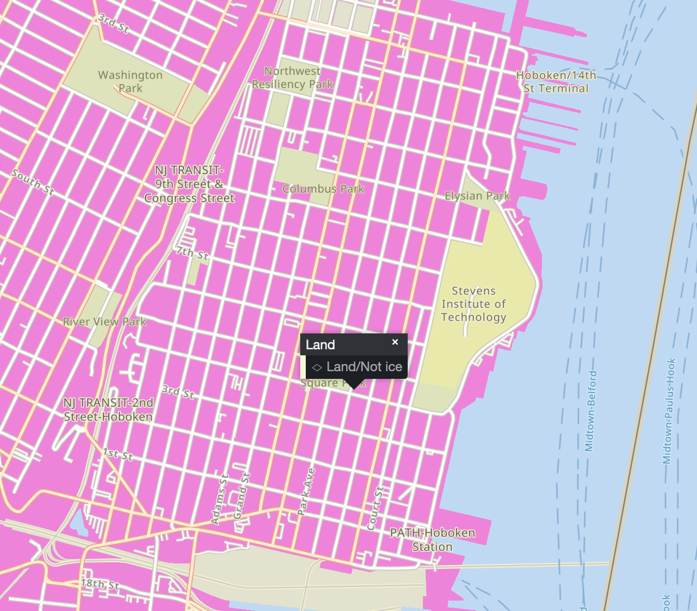

# Create a Custom Map Style with Amazon Location Service

UX designers and web developers alike wish to have each component of a website meet the company’s branding requirements while providing a visual impact on its own. Web maps are no exception to this. They provide important visualizations for geographical data. The ability to customize is invaluable when a map is a big part of the user flow and needs to fit in with the rest of the site.

With [Amazon Location Service](https://aws.amazon.com/location/), a managed AWS service for adding location data to applications, you can create a customized web map that will grab the interest of your users and increase engagement. At this time Location Service has two data providers, [Esri](https://aws.amazon.com/location/data-providers/esri/) and [HERE](https://aws.amazon.com/location/data-providers/here-technologies/), as well as six default map styles. So, how do you customize these map styles to meet your brand or visual design?

This README will walk you through the process of styling an existing map using [Maputnik](https://maputnik.github.io/) to help visualize the changes in real-time. Others may prefer to use another open source tool called [Fresco](https://fresco.go-spatial.org/), however they are not required to make edits to the style descriptor. In order to style our existing map from Amazon Location Service using these tools we will also demonstrate how to run a local proxy that handles [Signature Version 4 / AWS Authentication](https://docs.aws.amazon.com/general/latest/gr/signature-version-4.html).

The following walk through is split into 2 parts:

1. [How to style an existing Map from Amazon Location Service](#how-to-style-an-existing-map-from-amazon-location-service).
2. [How to integrate a custom map style in a React app](#how-to-integrate-a-custom-map-style-in-a-react-app)

Note that the terminal commands will be Mac/Linux specific.

## Prerequisites

- node v16.x
- npm v8.x
- Amplify CLI v9.1.x
- Maputnik v1.7.0 ([download here](https://github.com/maputnik/editor/releases/tag/v1.7.0))

## Setup base app

To get started, we will install the dependencies for the React Amplify app that we will use later:

```sh
npm i
```

Then, let's initialize the Amplify app:

```sh
amplify init
```

Finally, deploy the backend resources:

```sh
amplify push
```

This step will create a new Amazon Location Service Map resource with the appropriate configuration and permissions for you to use later.

## How to style an Amazon Location Service Map

Maputnik is an open source visual editor for the [Mapbox Style Specification](https://www.mapbox.com/mapbox-gl-js/style-spec). At the time of writing this editor can be either used in the browser or downloaded as a binary and can run locally. We are going to use the latter option.

After having downloaded the appropriate binary, you will need to make it executable, then run it:

```sh
chmod +x ./maputnik
./maputnik
```

And open your browser at [http://localhost:8000/#4.3/42.75/8.59](http://localhost:8000/#4.3/42.75/8.59) and create a new blank canvas. Click "Open" in the top navigation bar, then scroll down to the bottom of "Gallery Styles" and selected "Empty Style".



_Open A Style_



_Empty Canvas_

Now, in order to serve the map we will need to create a proxy server. We will use Tessera. Tessera is a pluggable [map tile](https://en.wikipedia.org/wiki/Tiled_web_map) server. Using the power of the [tilelive](https://github.com/mapbox/tilelive) ecosystem, it is capable of serving and rendering map tiles from many sources. To stream data from most sources you can install the tilelive providers as npm packages. For an Amazon Location Service source we use tilelive-aws.

From a new terminal window, change the directory to the `tileserver` one:

```sh
cd tileserver
```

Then, install the dependencies

```sh
npm i
```

Next we need to add the Amazon Location Service API as a data source. However, in order to do this we need to use a local proxy that can handle SigV4 (TL;DR a way to provide your AWS credentials with http requests). For this we will use [tessera](https://github.com/mojodna/tessera) and [tilelive-aws](https://github.com/beatleboy501/tilelive-aws). From a new terminal (the `maputnik` process will be occupying the other terminal) run the following:

Assuming you have the standard AWS environment variables (`AWS_ACCESS_KEY_ID`, `AWS_SECRET_ACCESS_KEY`, `AWS_REGION`, or `AWS_PROFILE`) set correctly, this should be enough to get started using `tessera`. You'll need to provide the full file path to your module, so from your terminal run:

```sh
node_modules/tessera/bin/tessera.js -r tilelive-aws aws:///customStyleMap-dev
```

> **Note**
> You can also add this as a script to the `package.json` file that was created to save time on subsequent invocations. You can add it to the `scripts` section like so:

```json
{
    ...
    "scripts": {
        "tessera": "node_modules/tessera/bin/tessera.js -r tilelive-aws aws:///customStyleMap-dev"
    },
    ...
}
```

Once started, you should see an oputput similar to: `Listening at http://0.0.0.0:8080`.

Now go back to Maputnik in your browser and click "Data Sources" in the top navigation bar. There should not be any active data sources. If you see any be sure to delete them.



_Data Sources_

We're going to add a new data source as shown below.

- `Source ID`: `esri`
- `Source Type`: `Vector (XYZ URLs)`
- `1st Tile URL`: `http://localhost:8080/{z}/{x}/{y}.pbf`
- `Min Zoom`: `0`
- `Max Zoom`: `22`



_New Data Source_

In addition to Tiles, the type of web map we will be styling also makes use of **Glyphs** and **Sprites**. We can't use Tessera to proxy the endpoints for these, but we can however use some out of the box endpoints built in to Maputnik. Sprites: `https://maputnik.github.io/osm-liberty/sprites/osm-liberty` and Glyphs: `https://api.maptiler.com/fonts/{fontstack}/{range}.pbf?key={key}`)

If you want to download a copy of the Sprites and Glyphs for your Amazon Location Service Map, we've included a helper script `downloadSpritesGlyphs.sh` :

```sh
./downloadSpritesGlyphs.sh customStyleMap-dev default
```

This should create a folder for `sprites` and a folder for `glyphs` with a number of options for each. The [Sprites](https://docs.aws.amazon.com/cli/latest/reference/location/get-map-sprites.html) endpoint can serve "Spritesheets" which consist of a paired set of `.png` and `.json` files. The `.png` file will contain all of the images and the `.json` file provides the offsets of each image within the `.png` file. These images can be used on the map for things like points of interests, highways, etc. [Glyphs](https://docs.aws.amazon.com/cli/latest/reference/location/get-map-glyphs.html) are a combination of a font-family and a Unicode range. These can be used to display place names as text on the map.

We can start with a ready-made style template. Click "Open" in the top navigation bar and under "Upload Style" click "Upload" and select the `example-style-descriptor.json` file included in this repo.

This is the style descriptor that is provided by Amazon Location Service as part of your Esri Map but with a few modifications. You can download this JSON file by making a request with the AWS CLI, i.e.

```sh
aws location get-map-style-descriptor --map-name customStyleMap-dev example-style-descriptor.json --profile default
```

Because we are proxying our map tiles through a local tileserver we have changed a few lines in the descriptor JSON to point to the local endpoint. (We'll change them back later).

Before

```json
...
"sources": {
    "amazon": {
    "type": "vector",
    "tiles": ["https://maps.geo.<YOUR AWS REGION>.amazonaws.com/maps/v0/maps/customStyleMap-dev/tiles/{z}/{x}/{y}"],
    "minZoom": 0,
    "maxZoom": 22
    }
},
...
```

After

```json
...
"sources": {
    "esri": {
    "attribution": "Esri, HERE, Garmin, FAO, NOAA, USGS, © OpenStreetMap contributors, and the GIS User Community",
    "maxzoom": 15,
    "tiles": ["http://localhost:8080/{z}/{x}/{y}.pbf"],
    "type": "vector"
    }
},
"sprite": "https://maputnik.github.io/osm-liberty/sprites/osm-liberty",
"glyphs": "https://api.maptiler.com/fonts/{fontstack}/{range}.pbf?key={key}",
...
```

From the "_View_" dropdown let's select "_Map_"

Now we should see a list of layers appear on the left side of the screen



_List of Layers_

Let's select the `Land/Not Ice` Layer



_The Land/Not ice Layer_

Scroll down to the JSON Editor section on the left navigation panel



_The JSON Editor_

Note that its fill color is `#f7f6d5`, let's change it to something funky like `#EE84D9`



_Layer Before_



_Layer After_

Now you can see how the map's style has changed a little, you play around some more by clicking on certain areas of the map and seeing which layer it corresponds. Feel free to change colors or outlines

### Map Styling Tips

To help you with your map styling decisions, here are some handy tips:

- Familiarize yourself with the MapLibre style document specification <https://maplibre.org/maplibre-gl-js-docs/style-spec/>
- Learn hexadecimal color values and pick a palette of colors
- Follow web accessibility guidelines to ensure there are no impediments to users with disabilities
- Plan for adding map markers later on and choose a color that will contrast
- Use gradients and color transparency for greater detail
- Reserve blue colors for water layers only
- Ensure legible text values by choosing the best label background and text halo

## How to integrate a custom map style in a React app

When you are happy with the result of your map style you can export it and use it in your application.

From your Maputnik tab in the browser, click "Export" in the top navigation bar and download the file.

You should move the file as `example-file-descriptor.json` and place it in your React project's `src/` directory

Remember to change back the lines pointing to the local endpoints:

From

```json
"tiles": ["http://localhost:8080/{z}/{x}/{y}.pbf"],
```

To

```json
"tiles": ["https://maps.geo.<YOUR AWS REGION>.amazonaws.com/maps/v0/maps/customStyleMap-dev/tiles/{z}/{x}/{y}"],
```

Also be sure to delete the `sprite` and `glyph` attributes.

```json
"sprite": "https://maps.geo.<YOUR AWS REGION>.amazonaws.com/maps/v0/maps/customStyleMap-dev/sprites/sprites",
"glyphs": "https://maps.geo.<YOUR AWS REGION>.amazonaws.com/maps/v0/maps/customStyleMap-dev/glyphs/{fontstack}/{range}.pbf",
```

## Clean Up

To avoid incurring future charges, delete the resources used in this tutorial. To do so run `amplify delete` and follow the prompts.

## Conclusion

Using Amazon Location Service with other AWS Services and open source tools such as Maputnik and MapLibre, you can create a fully customizable Map style especially when maps are an integral part of your application and you want to give your maps a personalized touch. Now, if you have an idea about how you can achieve the map customization, you can also try it with [Fresco](https://fresco.go-spatial.org/), Mapbox Studio, or other open source tools for editing.
