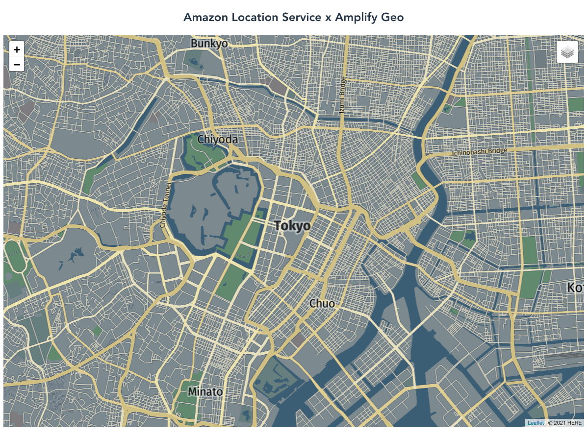

# Leaflet Vue AWS Amplify x Amazon Location Service



This example demonstrates how to use Leaflet with Amazon Location Service and AWS Amplify within a Vue.js application.

## Execution environment

- node v16.x
- npm v8.x
- Amplify CLI v9.1.x

## Getting started

1. Install the Amplify CLI: `npm install -g @aws-amplify/cli`
2. Install project dependencies: `npm install`
3. Create a new Amplify project environment: `amplify init`
4. Create Auth and Geo resources: `amplify push`

## Compiles and hot-reloads for development

```sh
npm start
```

## Compiles and minifies for production

```sh
npm run build
```

## Cleaning up

To clean up all resources created for this application, run the following:

```sh
amplify delete
```

## Security

See [CONTRIBUTING](../CONTRIBUTING.md) for more information.

## License

This library is licensed under the MIT-0 License. See the LICENSE file.
