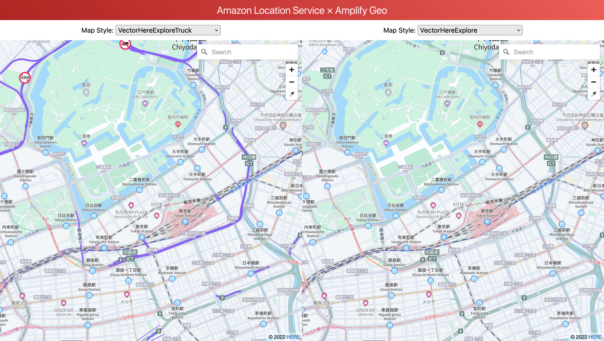

# Amazon Location Service Map Comparison
* This is a web based sample built with Vue that uses AWS Amplify Geo to display two maps side by side.
* Amazon Location Service offers several map styles from several providers, and this sample will help you compare them. Because the two maps are synchronized and can be compared under the same circumstances.
* The AWS resources (Amazon Cognito & Amazon Location Service Maps) are created via Amplify CLI. The sample already comes with predefined configurations that you only have to deploy using the Amplify CLI.



## Prerequisites
* node v19.x
* npm 9.x
* Amplify CLI 11.x

## Getting started
1. Clone the repository: `git clone https://github.com/aws-samples/amazon-location-samples.git`
1. Go this folder: `cd amazon-location-samples/maplibre-gl-js-vue-amplify-compare-maps`
1. Install and configure the Amplfiy CLI: [See documentation](https://docs.amplify.aws/cli/start/install/)
1. Install project dependencies: `npm install`
1. Create a new Amplify project environment: `amplify init`
1. Create Auth and Geo resources: `amplify push`
1. Publish your application: `amplify publish`

## Compiles and hot-reloads for development
```
npm run start
```

## Compiles and minifies for production
```
npm run build
```

## Cleaning up
```
amplify delete
```

## Security
See [CONTRIBUTING](https://github.com/aws-samples/amazon-location-samples/blob/main/CONTRIBUTING.md) for more information.

## License
This library is licensed under the MIT-0 License. See the LICENSE file.
