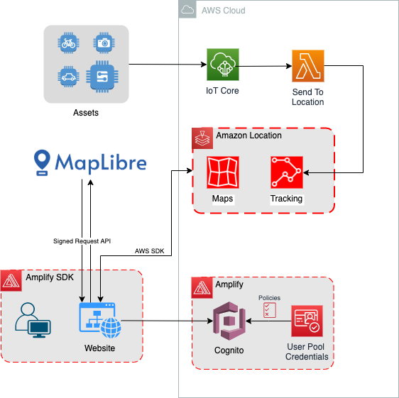
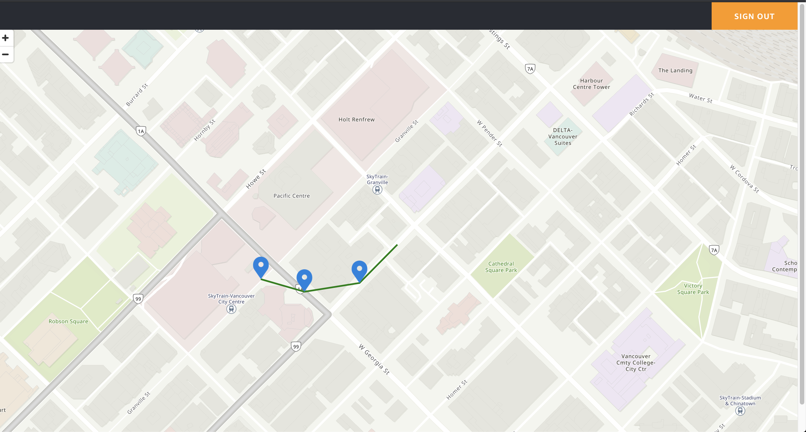

# Asset tracking with Amazon Location, Amplify and IoT Core

Amazon Location Service makes it easier for customers to work with maps, device tracking, and location-based features. It exists to allow AWS customers to have a single hub for all their geolocation needs.

This project aims to have authenticated users track their devices positions in a map, with trackers highlighting their reported location. The positions are tracked with AWS IoT Core and sent to a Lambda function that will update the device position in Amazon Location service.

AWS Amplify will help us create our backend in order to authenticate users and get credentials with authorization to log in.

## Overview of solution



##

##

### Prerequisites

For this project, you should have the following prerequisites:

- An AWS account with access to create and edit resources in the architecture
- AWS CLI installed and configured credentials
- `npm` installed
- AWS Amplify CLI installed (`npm install -g @aws-amplify/cli`)

## Walkthrough

The solution uses data gathered from Amazon Location trackers, to display markers over a map that is also provided by Amazon Location and its map providers. Later we will use the [MapLibre GL JS library](https://github.com/maplibre/maplibre-gl-js) to render our map. A user must authenticate using Amazon Cognito in order to get the information that will be rendered. After receiving an authentication TOKEN, the user signs the request with AWS Signature Version 4 display the map.

Overview of the steps:

1. `npm install`
2. Install and Initialize Amplify Application
   1. Add Authentication with Amplify Authenticator helper
3. Create a Map in Amazon Location
4. Create an Tracker into Amazon Location
5. Creating an AWS Core Rule to send data to a Amazon Location
6. Create the Lambda function with provided zip code and send data to Amazon Location
7. Create the Thing and publish data to the topic
8. Create a Rule and add the action to send data to a Lambda function
9. Integrating all resources to the web application
   1. Add Roles to Cognito Authenticated users
10. Run the Application

### 1. `npm install`

Install all required packages described in package.json.

### 2. Install and Initialize Amplify application

Install AWS Amplify library (aws-amplify) and also Amplify React specific UI components library to help us build components used in the application, especially the ones related to Authentication through Cognito.

In the root of the project run:

```bash
npm install aws-amplify @aws-amplify/ui-react
```

Run the following command and the following options to start an Amplify application project and create it’s environment on AWS cloud:

<sub><sup>Amplify creates resources to AWS us-east-1 region. in order to change that run `amplify configure` before `amplify init`, refer to the [documentation](https://docs.amplify.aws/cli/start/install#option-2-follow-the-instructions) for more instructions. </sup></sub>

```
amplify init

? Enter a name for the project amznlctassettrack
? Enter a name for the environment dev
? Choose your default editor: Visual Studio Code
? Choose the type of app that you're building javascript
Please tell us about your project
? What javascript framework are you using react
? Source Directory Path:  src
? Distribution Directory Path: build
? Build Command:  npm run-script build
? Start Command: npm run-script start
Using default provider  awscloudformation
? Select the authentication method you want to use: AWS profile

For more information on AWS Profiles, see:
https://docs.aws.amazon.com/cli/latest/userguide/cli-configure-profiles.html

? Please choose the profile you want to use default
```

#### Adding Authentication with Amplify authenticator helper

Amplify uses Amazon Cognito to for authentication provider. Cognito will let us handle user registration, authentication, account recovery and some more operations. To add it to our current project we will use Amplify CLI, using the following command and options:

```
$amplify add auth

Using service: Cognito, provided by: awscloudformation
The current configured provider is Amazon Cognito.
Do you want to use the default authentication and security configuration? Default configuration
Warning: you will not be able to edit these selections.
How do you want users to be able to sign in? Username
Do you want to configure advanced settings? No, I am done.
Successfully added auth resource amznlctassettrack[...]]locally
```

Now that we added the resource locally, we need to deploy it to the cloud with command:

```
amplify push
✔ Successfully pulled backend environment dev from the cloud.
Current Environment: dev
| Category | Resource name             | Operation | Provider plugin
| -------- | ------------------------- | --------- | -----------------
| Auth     | amznlctassettrack[...]    | Create    | awscloudformation
? Are you sure you want to continue? Yes
```

Now you can use Amplify CLI to change backend resources and their specification in saved in `aws-exports.js`.

### 3. Create a Map in Amazon Location

Create a map named “assetTracker”, following the steps [here](https://docs.aws.amazon.com/location/latest/developerguide/create-map-resource.html) provided by Amazon Location team. Use CLI or the AWS Console with the default map style. If you decide to use another name, write it down so it can be used in further steps with Maplibre GL JS api.

### 4. Create an Tracker into Amazon Location

Create aa Tracker using the Amazon Location console and name it “trackedAsset01” following the steps described in “Create a Tracker” section of the [documentation](https://docs.aws.amazon.com/location/latest/developerguide/start-tracking.html).

### 5. Creating an AWS IoT Core Rule to send data to a Amazon Location

We will receive messages about assets' positions through IoT Core, using secure TLS messages between devices and topics. In IoT Core, the topic responsible for getting the devices' positions will be monitored by an IoT Rule which is responsible for passing this data to a Lambda function for further processing. This Lambda function can transform the received data and pass it to Amazon Location using the AWS SDK.

### 6. Create the Lambda function to send data to Amazon Location

Follow these steps to setup your Lambda function:

1. Download `track_function1.zip` Lambda package for Amazon Location in the [lambdaPackage folder]().
2. Open the [Lambda Console](https://console.aws.amazon.com/lambda/home) in the left navigation bar choose **Functions**.
3. Then choose **Create function** and select **Author from scratch**
4. Enter the **Function name** “trackFunction1” and **Runtime** “Python 3.8”
5. Scroll down and choose **Create function** to create the Lambda function
6. In the **Configuration** tab scroll down to **Function code** and click on **Actions** to select **Upload a .zip file**
7. Click on **Upload** and select the .zip file download on Step 1.
   1. If you changed the name of your tracker when creating it, enter it in the **TRACKER_NAME** variable in the lambda_function.py code from environment menu on the left.
8. Choose **Deploy** to deploy the code.
9. Scroll up to the top of the page and choose the **Permission** tab
10. Click on the hyperlink under the **Role name** to open the role assigned to the Lambda function.
11. On the summary page under **Permission Policies** choose **Add inline policy** and the **JSON** tab, replace the region you are using and your account number in the following code and paste it in the text field:

```json
{
  "Version": "2012-10-17",
  "Statement": [
    {
      "Effect": "Allow",
      "Action": "geo:BatchUpdateDevicePosition",
      "Resource": "arn:aws:geo:[enter_current_region]:[Enter_Account_Number]:tracker/trackedAsset01"
    }
  ]
}
```

<sub><sup>if you changed the name of the tracker, you should change it in the following ARN too.</sup></sub>

12. Click on Review Policy
13. Give a name to the policy such as “BatchUpdateLocationWriteOnly”
14. Choose **Create policy**

### 7. Create a Thing and publish data to the IoT Topic

Before creating the IoT Thing we should create a Policy ofr it to be associated with. These are the steps to create the IoT policy:

1. Open the [AWS IoT Core console](https://console.aws.amazon.com/iot/)
2. In the left navigation pane, choose **Secure** and then **Policies.**
3. Choose **Create** to create a new policy or **Create a policy**, if you don't have one yet.
4. Enter a **Name** for your policy such as “trackPolicy”
5. Choose **Advanced Mode**, and enter the following code in **Add statements** section. Substitute your region and account number below:

```json
{
  "Version": "2012-10-17",
  "Statement": [
    {
      "Effect": "Allow",
      "Action": "iot:Connect",
      "Resource": "arn:aws:iot:[enter_current_region]:[Enter_Account_Number]:client/trackThing01"
    },
    {
      "Effect": "Allow",
      "Action": "iot:Publish",
      "Resource": "arn:aws:iot:[enter_current_region]:[Enter_Account_Number]:topic/iot/trackedAssets"
    }
  ]
}
```

6. Choose **Create.**

Check out [Create an AWS IoT Core policy](https://docs.aws.amazon.com/iot/latest/developerguide/create-iot-policy.html) and [AWS IoT Core policies](https://docs.aws.amazon.com/iot/latest/developerguide/iot-policies.html) for more information.

**Create the IoT Thing:**

1. Open the [AWS IoT Core console](https://console.aws.amazon.com/iot/)
2. On the left menu bar choose **Manage,** then click on **Things.**
3. Choose **Create** to create a new thing.
4. Then choose **Create a single thing**
5. Enter the name “trackThing01” and **Next** at the end of the Page. (if choose another name for your thing, make sure to change it in the policy code above after **client/[your thing name]**)
6. On the **Add a certificate for your thing** page, choose **Create certificate**.
7. On the **Certificate created!** page, follow these steps:
   1. Create a folder to host your certificates, in this case the `certs` folder
   2. Download the certificates and the keys for your thing to the `certs` folder, and rename the files accordingly:
      1. Device Certificate name as `trackThing01-certificate.pem.crt`
      2. Public key name as `trackThing01-public.pem.key`
      3. Private key name as `trackThing01-private.pem.key`
   3. Under **You also need to download a root CA for AWS IoT**, click **Download** and click on the hyperlink for **Amazon Root CA 1**, it will open the certificate in your browser. Save it or Copy and paste it in a text file. Name the downloaded file as root-CA.crt and copy it to the `certs` folder.
   4. On the thing creation page choose **Activate**
8. Choose **Attach a policy**, select the “trackPolicy” created previously.
9. Select **Register Thing**

**Run local Python code to simulate an IoT Thing**

_Follow the steps described [here](https://realpython.com/installing-python/) if you do not have python installed._

1. Install the AWS IoT Device SDK for Python, run:

```bash
python3 -m pip install awsiotsdk
```

2. Copy the certificates in `certs/` to `connect_device_package/certs`:

   `cp certs/*.crt connect_device_package/certs`

3. Go to the [AWS IoT Core console](https://console.aws.amazon.com/iot/), and select **Manage** on the left menu
4. Choose **Things** and then select the **trackThing01**
5. Choose **Interact**, and copy the HTTPS endpoint. It should in the following format:

   `<code>-ats.iot.<region>.amazonaws.com`

6. Paste this code in **[Insert your Endpoint Here]** inside `asset_code.py` file.
7. In the terminal, **cd** into the `connect_device_package` folder and run `python asset_code.py` to publish locations:

   `cd connect_device_package && python3 asset_code.py`

### 8. Create a Rule and add the action to send data to a Lambda function

The AWS IoT Core Rule will forward device position information to the AWS Lambda function to transform it and send to Amazon Location.

1. Go to the AWS IoT Core Console
2. On the left menu select **Act** and then choose **Rules.**
3. Choose **Create a rule**
4. Give your rule a name, such as “assetTrackingRule”
5. Under **Rule query statement** substitute the code starting with `SELECT * FROM..` for:
   `SELECT * FROM 'iot/trackedAssets'`
6. Under **Set one or more actions** choose **Add action**
7. Choose **Send a message to a Lambda function,** scroll down and select **Configure action**
8. Select the Lambda function create above from the dropdown list.
9. Choose **Add action**
10. Choose **Create Rule**

### Integrating all resources to the web application

#### _Add Roles to Cognito Authenticated users_

The following steps will enable the base cloudformation script and modify the authenticated users permissions. The following instructions are compatible with Visual Studio Code (VSCode), but similar configurations exists depending on the IDE selected on the **amplify init** options:

1. On the project **amplify** folder, expand **.vscode** folder (This may very from each IDE, this works for Visual Studio Code) and open **settings.json**
2. Change the line "amplify/\*\*/\*-parameters.json": true to "amplify/\*\*/\*-parameters.json": false.
3. On the explorer tab navigate to **amplify/backend/auth/amznlctassettrack[…]** and open the file **parameters.json**
4. After **“dependsOn[]”** insert the following code:

```json
   ,
   "authRoleName":{
      "Ref": "AuthRole"
   },
```

5. Open the file in the folder “**auth/amznlctassettrack..”,** its name should start with **amznlctassettrack[…]** and it describes the template for the creation of the authentication resources.
6. Under parameters enter the code to the role name parameter:

```yaml
authRoleName:
  Type: String
```

7. Under the **Resources** part of the cloudformation template, insert the policy that allow authenticated users to read Amazon Location resources:

<sub>Replace the region and your account number in the resource ARN.</sub>

```yaml
MapsReadOnlyPolicy:
  #Policy to be attached to authenticated users role.
  #Policy give Authenticated users rights to read information from Amazon Location.
  Type: AWS::IAM::Policy
  Properties:
    PolicyName: "mapsReadOnly"
    PolicyDocument:
      Version: "2012-10-17"
      Statement:
        - Effect: Allow
          Action:
            - geo:DescribeMap
            - geo:BatchGetDevicePosition
            - geo:GetMapGlyphs
            - geo:GetDevicePositionHistory
            - geo:DescribeTracker
            - geo:GetMapSprites
            - geo:GetMapStyleDescriptor
            - geo:GetDevicePosition
            - geo:GetMapTileJson
            - geo:GetMapTile
          Resource:
            - arn:aws:geo:[enter_current_region]:[Enter_Account_Number]:map/assetTracker
            - arn:aws:geo:[enter_current_region]:[Enter_Account_Number]:tracker/trackedAsset01
        - Effect: Allow
          Action:
            - geo:ListMaps
            - geo:ListTrackers
          Resource: "*"
    Roles:
      - !Ref authRoleName
```

8. Save both the parameters.json file and the current template file.
9. In the terminal for the project, run **amplify push** to deploy the resources to the cloud.

Creating resources updating the CloudFormation templates of Amplify ensures best practices in deploying infrastructure. All infrastructure is ready to be redeployed. And when we push resources to the cloud, an s3 project of the resources stores the files.

### 10. Run the application

With resources in place you are able to run the application and get a result.

Run `npm start` and navigate in your WebBrowser to [http://localhost:3000](http://localhost:3000) (This should happen automatically after `npm start`). **Sign Up** in the applicaiton and **Sign In**, if not Logged In already.
You should be able to get an application such as:



### Cleaning up

To avoid incurring future charges, delete the resources used in this tutorial. Here is a checklist to help:

- IoT Thing trackThing01 and its certificates and policies
- IoT Rule assetTrackingRule
- Lambda function trackFunction1 and its role
- Amplify Project and the bucket it creates with the code (make sure the CloudFormation stack is deleted with all its resources)

## Troubleshooting

### 1. Amplify Resources Region

All Amplify resources are created by default in the `us-east-1` Region. If you are planning with interface with existing resources or might be looking to launch the application in other regions, you will need to configure it before running `amplify init`.
To change the project default and region after installing the amplify CLI run `amplify configure`, you will be able to set a region and the username for the IAM user.
For more information refer to [Amplify Documentation](https://docs.amplify.aws/cli/start/install#option-2-follow-the-instructions)
