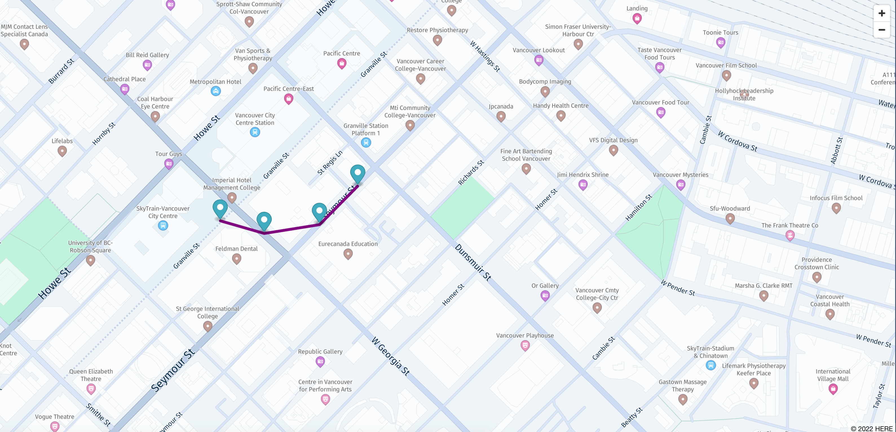

# Asset tracking with Amazon Location, Amplify and IoT Core

Amazon Location Service makes it easier for customers to work with maps, device tracking, and location-based features. It exists to allow AWS customers to have a single hub for all their geolocation needs.

This project aims to have authenticated users track their devices positions in a map, with trackers highlighting their reported location. The positions are tracked with AWS IoT Core and sent to a Lambda function that will update the device position in Amazon Location service.

AWS Amplify will help us create our backend in order to authenticate users and get credentials with authorization to log in.

## Overview of solution


### Prerequisites

For this project, you should have the following prerequisites:

- An AWS account with access to create and edit resources in the architecture
- AWS CLI installed and configured credentials
- Node.js (`>=v14.x`) and `npm` (`>=v8.x`) installed on your machine
- AWS Amplify CLI (`>=v9.2.x`) installed (`npm install -g @aws-amplify/cli`)

## Walkthrough

The solution uses data gathered from Amazon Location trackers, to display markers over a map that is also provided by Amazon Location and its map providers. Later we will use the [MapLibre GL JS library](https://github.com/maplibre/maplibre-gl-js) to render our map. A user must authenticate into the app using Amazon Cognito to be able to see the map and the tracker location.

Overview of the steps:

1. Clone the repository and move into the folder that contains this sample (`maplibre-js-react-iot-asset-tracking`)
2. Install the application's dependencies by running `npm install`
3. Create resources with AWS Amplify CLI:
4. Initialize a new Amplify application by running `amplify init`
5. Add a Map and Authentication to your application by running `amplify add geo` (this will automatically prompt you to also add the required authentication resources)
6. Create a custom Amplify resource for the Amazon Location Service Tracker (`amplify add custom`)
7. Create an AWS Lambda function with Amplify using the code provided (`amplify add function`), this function will be used to update the tracker position in Amazon Location service
8. Using the console, create an AWS IoT Core Certificate to allow the IoT Thing to connect to the AWS IoT Core
9. Create a custom Amplify resource for the AWS IoT Core resources (`amplify add custom`)
10. Allow the IoT Rule to trigger the Lambda function
11. Simulate the IoT Thing sending location updates to AWS IoT Core
12. Run the Application

### 1. Install application dependencies

To install all the required packages run `npm install` in the root directory of the project.

### 2. Install and Initialize Amplify application

If this is the first time you're using Amplify, run `amplify configure` before continuing to configure the AWS Region and other info, refer to the Amplify [documentation](https://docs.amplify.aws/cli/start/install#option-2-follow-the-instructions) for more instructions.

In the root of the project run the following command and the following options to start an Amplify application project and create it’s environment on AWS:

```
amplify init
Note: It is recommended to run this command from the root of your app directory
? Enter a name for the project maplibrejsreactiot
The following configuration will be applied:

Project information
| Name: maplibrejsreactiot
| Environment: dev
| Default editor: Visual Studio Code
| App type: javascript
| Javascript framework: react
| Source Directory Path: src
| Distribution Directory Path: build
| Build Command: npm run-script build
| Start Command: npm run-script start

? Initialize the project with the above configuration? Yes
Using default provider  awscloudformation
? Select the authentication method you want to use: AWS profile

For more information on AWS Profiles, see:
https://docs.aws.amazon.com/cli/latest/userguide/cli-configure-profiles.html

? Please choose the profile you want to use: default
```

### 3. Adding Authentication and Map resources with Amplify

Amplify uses Amazon Cognito as an authentication provider and Amazon Location Service to create maps. Cognito will help us handle user registration, authentication, account recovery and some more operations.

When you run `amplify add geo` in a empty project Amplify will ask you if you want to add the required Authentication resources to your project, follow the prompts to add an Amazon Location Service Map and Amazon Cognito resources to your project:

```
amplify add geo
? Select which capability you want to add: Map (visualize the geospatial data)
✔ geo category resources require auth (Amazon Cognito). Do you want to add auth now? (Y/n) · yes
Using service: Cognito, provided by: awscloudformation
 
 The current configured provider is Amazon Cognito. 
 
 Do you want to use the default authentication and security configuration? Default configuration
 Warning: you will not be able to edit these selections. 
 How do you want users to be able to sign in? Username
 Do you want to configure advanced settings? No, I am done.
✅ Successfully added auth resource maplibrejsreactiotasf3978ca5 locally

✅ Some next steps:
"amplify push" will build all your local backend resources and provision it in the cloud
"amplify publish" will build all your local backend and frontend resources (if you have hosting category added) and provision it in the cloud

✔ Provide a name for the Map: · mapiottracker
✔ Who can access this Map? · Authorized and Guest users
Available advanced settings:
- Map style & Map data provider (default: Streets provided by Esri)

✔ Do you want to configure advanced settings? (y/N) · yes
✔ Specify the map style. Refer https://docs.aws.amazon.com/location-maps/latest/APIReference/API_MapConfiguration.html · 
Explore (data provided by HERE)
⚠️ Auth configuration is required to allow unauthenticated users, but it is not configured properly.
✅ Successfully updated auth resource locally.
✅ Successfully added resource mapiottracker locally.
```

### 4. Create an Amazon Location Tracker custom resource with Amplify

At the moment the Amplify Geo category doesn't support creating Trackers directly, but we can create a custom resource that will be used to create trackers using an [Amazon CDK](https://aws.amazon.com/cdk/) template.

```
amplify add custom
✔ How do you want to define this custom resource? · AWS CDK
✔ Provide a name for your custom resource · trackerAsset
✅ Created skeleton CDK stack in amplify/backend/custom/trackerAsset directory
✔ Do you want to edit the CDK stack now? (Y/n) · no
```

With the command above Amplify has created a skeleton CDK stack in the `amplify/backend/custom/trackerAsset` directory of your project. Before creating the Tracker we need to add an additional dependency to the CDK stack, to do so open the `amplify/backend/custom/trackerAsset/package.json` file with your favorite text editor (i.e. VS Code) and replace its content with the following:

```json
{
  "name": "custom-resource",
  "version": "1.0.0",
  "description": "",
  "scripts": {
    "build": "tsc",
    "watch": "tsc -w",
    "test": "echo \"Error: no test specified\" && exit 1"
  },
  "dependencies": {
    "@aws-amplify/cli-extensibility-helper": "^2.0.0",
    "@aws-cdk/core": "~1.165.0",
    "@aws-cdk/aws-iam": "~1.165.0",
    "@aws-cdk/aws-location": "~1.165.0"
  },
  "devDependencies": {
    "typescript": "^4.2.4"
  }
}
```

Next, open the `amplify/backend/custom/trackerAsset/cdk-stack.ts` file in your text editor and add a Tracker resource. After editing your file should look like this:

```ts
import * as cdk from "@aws-cdk/core";
import * as AmplifyHelpers from "@aws-amplify/cli-extensibility-helper";
import { AmplifyDependentResourcesAttributes } from "../../types/amplify-dependent-resources-ref";
import * as location from "@aws-cdk/aws-location";

export class cdkStack extends cdk.Stack {
  constructor(
    scope: cdk.Construct,
    id: string,
    props?: cdk.StackProps,
    amplifyResourceProps?: AmplifyHelpers.AmplifyResourceProps
  ) {
    super(scope, id, props);
    /* Do not remove - Amplify CLI automatically injects the current deployment environment in this input parameter */
    new cdk.CfnParameter(this, "env", {
      type: "String",
      description: "Current Amplify CLI env name",
    });
    /* AWS CDK code goes here - learn more: https://docs.aws.amazon.com/cdk/latest/guide/home.html */

    new location.CfnTracker(this, "Tracker", {
      trackerName: "trackerAsset01",
    });
  }
}
```

Now, with your terminal, navigate to the `amplify/backend/custom/trackerAsset` directory and run `npm install` to update the CDK dependencies we added in the previous step.

Finally, while in the main directory of your project, run `amplify override project`, this will generate a `amplify/backend/awscloudformation/override.ts` file that we can use to add policies to the Amplify IAM roles. Open the file and replace it with the following:

```ts
import { AmplifyRootStackTemplate } from "@aws-amplify/cli-extensibility-helper";

export function override(resources: AmplifyRootStackTemplate) {
  resources.unauthRole.addOverride("Properties.Policies", [
    {
      PolicyName: "trackerPolicy",
      PolicyDocument: {
        Version: "2012-10-17",
        Statement: [
          {
            Effect: "Allow",
            Action: ["geo:GetDevicePositionHistory"],
            Resource: {
              "Fn::Sub":
                "arn:aws:geo:${AWS::Region}:${AWS::AccountId}:tracker/trackerAsset01",
            },
          },
        ],
      },
    },
  ]);
}
```

### 5. Create an AWS Lambda function to update your Tracker

To update the Tracker position we need to create an AWS Lambda function that will be executed when a new event comes in from the IoT device. To create one using Amplify run the following command:

```
amplify add function
? Select which capability you want to add: Lambda function (serverless function)


? Provide an AWS Lambda function name: trackFunction1
? Choose the runtime that you want to use: NodeJS
? Choose the function template that you want to use: Hello World

Available advanced settings:
- Resource access permissions
- Scheduled recurring invocation
- Lambda layers configuration
- Environment variables configuration
- Secret values configuration

? Do you want to configure advanced settings? No
? Do you want to edit the local lambda function now? No
Successfully added resource trackFunction1 locally.
```

The command above will create a new AWS Lambda function in the `amplify/backend/function/trackfunction1` directory of your project. To update the code of the function open the `amplify/backend/function/trackfunction1/src/index.js` and replace its content with the following:

```js
const AWS = require("aws-sdk");

// Update this to match the name of your Tracker resource
const TRACKER_NAME = "trackerAsset01";
const location = new AWS.Location();

exports.handler = async (event) => {
  const updates = [
    {
      DeviceId: event.payload.deviceId,
      SampleTime: new Date(event.payload.timestamp).toISOString(),
      Position: [event.payload.location.long, event.payload.location.lat],
    },
  ];

  console.log(updates);

  let res;
  try {
    res = await location
      .batchUpdateDevicePosition({
        TrackerName: TRACKER_NAME,
        Updates: updates,
      })
      .promise();

    console.log(res);
  } catch (err) {
    console.log(err);
    return {
      statusCode: 500,
      body: JSON.stringify(err),
    };
  }

  const response = {
    statusCode: 200,
    body: JSON.stringify(res),
  };
  return response;
};
```

Finally we need to update the `amplify/backend/function/trackfunction1/custom-policies.json` file to allow our function to access the Tracker resource:

```json
[
  {
    "Action": ["geo:BatchUpdateDevicePosition"],
    "Resource": [
      {
        "Fn::Sub": "arn:aws:geo:${AWS::Region}:${AWS::AccountId}:tracker/trackerAsset01"
      }
    ]
  }
]
```

### 6. Create an AWS IoT Certificate

Before creating the AWS IoT resources with the Amplify CLI you need to create an AWS IoT certificate that is needed for the IoT Thing to authenticate and communicate with IoT Core.

To do this run the following command **while in the project root directory**, if you are in a different directory you will need to change the path of the output files accordingly:

```sh
aws iot create-keys-and-certificate \
    --set-as-active \
    --certificate-pem-outfile generate_thing_events/certs/certificate.pem.crt \
    --public-key-outfile generate_thing_events/certs/public.pem.key \
    --private-key-outfile generate_thing_events/certs/private.pem.key
```

Now run `aws iot list-certificates` to see the certificate you just created and take note of the `certificateId` that you will need to use when creating the other IoT resources.

```sh
certificates:
- certificateArn: arn:aws:iot:[region-name]:[account-id]:cert/18b7ac8eb628e210d3d56b145a2fb02696294015478ec2584910102b46473279
  certificateId: 18b7ac8eb628e210d3d56b145a2fb02696294015478ec2584910102b46473279 <- Take note of this
  creationDate: '2022-04-03T12:25:48.348000+00:00'
  status: ACTIVE
```

If you prefer, you can also create the certificate in the AWS IoT console and then download the certificate and private key files.

1. Open the [AWS IoT Core console](https://console.aws.amazon.com/iot/)
2. In the left navigation pane, choose **Secure** and then **Certificates.**
3. Click on **Add certificate** and then choose **Create certificate** to create a new certificate.
4. Select **Auto-generate new certificate (recommended)**, set the **Certificate Status** to **Active** and then click **Create**.
5. Download certificate and private key files from the **Download certificate** and **Download private key** buttons.
6. Take note of the **Certificate ID**, this is the ID that you will need to use when creating the other AWS IoT resources.
7. Move the certificate and private key files to the `generate_thing_events/certs/` directory of your project.

After creating the certificate and obtaining the private key files, you should have the following files in the `generate_thing_events/` directory:

```sh
generate_thing_events
├── certs
├ ├── certificate.pem.crt
├ ├── public.pem.key
├ ├── public.pem.key
├ └── root-CA.pem
├── index.js
├── package-lock.json
├── package.json
└── LICENSE
```

Check out [Create AWS IoT client certificates](https://docs.aws.amazon.com/iot/latest/developerguide/device-certs-create.html) for more information.

### 7. Create a AWS IoT resources using an Amplify custom resource

Similarly to the Tracker resource, we can create a custom resource to create the rest of the IoT resources. To create one using Amplify run the following command:

```sh
amplify add custom
✔ How do you want to define this custom resource? · AWS CDK
✔ Provide a name for your custom resource · iotResources
✅ Created skeleton CDK stack in amplify/backend/custom/iotResources directory
✔ Do you want to edit the CDK stack now? (Y/n) · no
```

With the command above Amplify has created a skeleton CDK stack in the `amplify/backend/custom/iotResources` directory of your project. Before starting to configure the stack you need to update the `amplify/backend/custom/iotResources/package.json` file with the following content:

```json
{
  "name": "custom-resource",
  "version": "1.0.0",
  "description": "",
  "scripts": {
    "build": "tsc",
    "watch": "tsc -w",
    "test": "echo \"Error: no test specified\" && exit 1"
  },
  "dependencies": {
    "@aws-amplify/cli-extensibility-helper": "^2.0.0",
    "@aws-cdk/core": "~1.165.0",
    "@aws-cdk/aws-iam": "~1.165.0",
    "@aws-cdk/aws-iot": "~1.165.0",
    "@aws-cdk/aws-iot-actions": "~1.165.0",
    "@aws-cdk/aws-lambda": "~1.165.0"
  },
  "devDependencies": {
    "typescript": "^4.2.4"
  }
}
```

Next, open the `amplify/backend/custom/iotResources/cdk-stack.ts` file in your text editor and add a Tracker resource. After editing your file should look like this:

```ts
import * as cdk from '@aws-cdk/core';
import * as AmplifyHelpers from '@aws-amplify/cli-extensibility-helper';
import { AmplifyDependentResourcesAttributes } from '../../types/amplify-dependent-resources-ref';
import * as iot from '@aws-cdk/aws-iot';
import * as actions from '@aws-cdk/aws-iot-actions';
import * as lambda from '@aws-cdk/aws-lambda';

export class cdkStack extends cdk.Stack {
  constructor(scope: cdk.Construct, id: string, props?: cdk.StackProps, amplifyResourceProps?: AmplifyHelpers.AmplifyResourceProps) {
    super(scope, id, props);
    /* Do not remove - Amplify CLI automatically injects the current deployment environment in this input parameter */
    new cdk.CfnParameter(this, 'env', {
      type: 'String',
      description: 'Current Amplify CLI env name',
    });

    /* AWS CDK code goes here - learn more: https://docs.aws.amazon.com/cdk/latest/guide/home.html */

    // Identifier for the IoT Core Certificate, REPLACE THIS WITH YOUR CERTIFICATE ID
    const CERTIFICATE_ID = <AWS IOT CERTIFICATE ID>;

    // Access other Amplify Resources
    const retVal:AmplifyDependentResourcesAttributes = AmplifyHelpers.addResourceDependency(this,
      amplifyResourceProps.category,
      amplifyResourceProps.resourceName,
      [
        {category: 'function', resourceName: 'trackFunction1'},
      ]
    );
    // Get the Lambda Function reference
    const trackFunction1Arn = cdk.Fn.ref(retVal.function.trackFunction1.Arn);
    const trackFunction1Ref = lambda.Function.fromFunctionArn(this, 'myFunction', trackFunction1Arn);

    // Create an IoT Core Policy
    const policy = new iot.CfnPolicy(this, 'Policy', {
      policyName: 'trackPolicy',
      policyDocument: {
        "Version": "2012-10-17",
        "Statement": [
          {
            "Effect": "Allow",
            "Action": "iot:Connect",
            "Resource": `arn:aws:iot:${cdk.Stack.of(this).region}:${cdk.Stack.of(this).account}:client/trackThing01`
          },
          {
            "Effect": "Allow",
            "Action": "iot:Publish",
            "Resource": `arn:aws:iot:${cdk.Stack.of(this).region}:${cdk.Stack.of(this).account}:topic/iot/trackedAssets`
          }
        ]
      }
    });

    // Attach the certificate to the IoT Core Policy
    const policyPrincipalAttachment = new iot.CfnPolicyPrincipalAttachment(this, 'MyCfnPolicyPrincipalAttachment', {
      policyName: policy.policyName,
      principal: `arn:aws:iot:${cdk.Stack.of(this).region}:${cdk.Stack.of(this).account}:cert/${CERTIFICATE_ID}`,
    });
    policyPrincipalAttachment.addDependsOn(policy);

    // Create an IoT Core Thing
    const thing = new iot.CfnThing(this, 'Thing', {
      thingName: 'trackThing01',
    });

    // Attach the certificate to the IoT Core Thing
    const thingPrincipalAttachment = new iot.CfnThingPrincipalAttachment(this, 'MyCfnThingPrincipalAttachment', {
      principal: `arn:aws:iot:${cdk.Stack.of(this).region}:${cdk.Stack.of(this).account}:cert/${CERTIFICATE_ID}`,
      thingName: thing.thingName,
    });
    thingPrincipalAttachment.addDependsOn(thing);

    // Create an IoT Topic Rule that will trigger the Lambda Function
    new iot.TopicRule(this, 'TopicRule', {
      topicRuleName: 'assetTrackingRule',
      sql: iot.IotSql.fromStringAsVer20160323(`SELECT * FROM 'iot/trackedAssets'`),
      actions: [new actions.LambdaFunctionAction(trackFunction1Ref)],
    });
  }
}
```

### 8. Deploy Amplify resources

Now that we have added the resource locally, we need to deploy them to the cloud by running:

```
amplify push -y
```

### 9. Create an AWS IoT Rule to trigger the Lambda function

When creating the IoT Rule we have referenced the `trackFunction1` function. This function belongs to a different stack and we were able to reference it by its ARN. Although you can use an imported resource anywhere, you cannot modify the imported resource. For example, you cannot add triggers or new permissions to the imported resource.

To fix this, we need to manually allow IoT Core to invoke the Lambda function. To do this, we need to add a new permission to the Lambda function:

```
aws lambda add-permission --function-name trackFunction1-dev --statement-id iot-events --action "lambda:InvokeFunction" --principal iot.amazonaws.com
```

If you prefer, you can also add the permission using the AWS Lambda console.

To learn more about how to work with imported resources, see the [AWS CDK documentation](https://docs.aws.amazon.com/cdk/v2/guide/resources.html#resources_importing).

### 10. Send dummy data to the AWS IoT Core device

In order to update the Tracker position you need to send data to the AWS IoT Core device. To do this you can use the script that we have created for you in the `generate_thing_events` folder.

If you have followed the instructions at the step [#6](#6-create-an-aws-iot-certificate), the `generate_thing_events` folder should now have the following structure:

```
generate_thing_events
├── certs
├ ├── certificate.pem.crt
├ ├── public.pem.key
├ ├── public.pem.key
├ └── root-CA.pem
├── index.js
├── package-lock.json
├── package.json
└── LICENSE
```

Before executing the script, run `npm install` in the `generate_thing_events` folder. Then open the `index.js` file and replace the following values with your own:

```js
const THING_ENDPOINT = "<code>-ats.iot.<region>.amazonaws.com";
const CLIENT_ID = "trackThing01";
const IOT_TOPIC = "iot/trackedAssets";
```

**Note:** You can retrieve the value for `THING_ENDPOINT` by running `aws iot describe-endpoint --endpoint-type iot:Data-ATS` or from the AWS IoT Core console:

1. Go to the [AWS IoT Core console](https://console.aws.amazon.com/iot/), and select **Manage** on the left menu
2. Choose **Things** and then select the **trackThing01**
3. Choose **Interact**, and copy the HTTPS endpoint. It should in the following format:

   `<code>-ats.iot.<region>.amazonaws.com`

Once all the values are filled in, run the script with `node index.js`. The script will send four messages to the AWS IoT Core device with an interval of 30 seconds in between. The logs should look like the following:

```sh
Connecting to <code>-ats.iot.<region>.amazonaws.com with client ID trackThing01
Connected to device trackThing01
Publishing message to topic iot/trackedAssets: {"payload":{"deviceid":"thing123","timestamp":1644517720009,"location":{"lat":49.282301,"long":-123.118408}}}
Publishing message to topic iot/trackedAssets: {"payload":{"deviceid":"thing123","timestamp":1644517750010,"location":{"lat":49.282144,"long":-123.117574}}}
Publishing message to topic iot/trackedAssets: {"payload":{"deviceid":"thing123","timestamp":1644517780012,"location":{"lat":49.282254,"long":-123.116522}}}
Publishing message to topic iot/trackedAssets: {"payload":{"deviceid":"thing123","timestamp":1644517810014,"location":{"lat":49.282732,"long":-123.115799}}}
```

### 10. Run the application

With resources in place you are able to run the application and see the markers position on the rendered map.

Run `npm start` and navigate in your browser to [http://localhost:8080](http://localhost:8080).
You should be able to get an application such as:



### Cleaning up

To avoid incurring future charges, delete the resources used in this tutorial. Here is a checklist to help:

- Amplify Project by running `amplify delete` in the project's root directory
- AWS IoT Certificate and any leftover resources

## Troubleshooting

### 1. Amplify Resources Region

All Amplify resources are created by default in the `us-east-1` Region. If you are planning with interface with existing resources or might be looking to launch the application in other regions, you will need to configure it before running `amplify init`.
To change the project default and region after installing the amplify CLI run `amplify configure`, you will be able to set a region and the username for the IAM user.
For more information refer to [Amplify Documentation](https://docs.amplify.aws/cli/start/install#option-2-follow-the-instructions)
