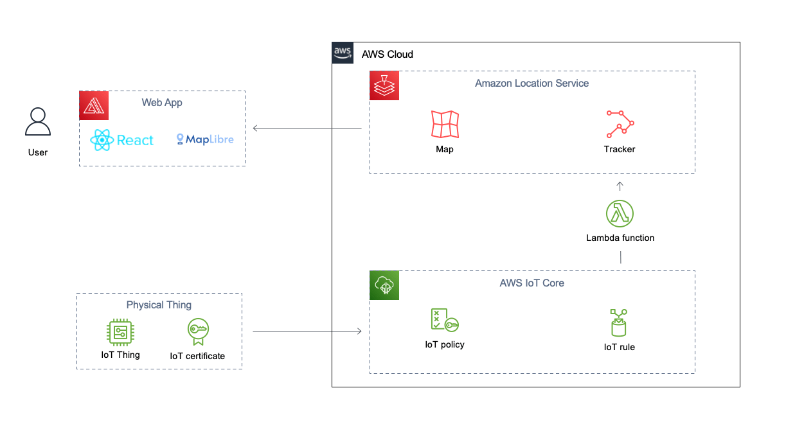

# Asset tracking with Amazon Location, Amplify and IoT Core

Amazon Location Service makes it easier for customers to work with maps, device tracking, and location-based features. It exists to allow AWS customers to have a single hub for all their geolocation needs.

This project aims to have authenticated users track their devices positions in a map, with trackers highlighting their reported location. The positions are tracked with AWS IoT Core and sent to a Lambda function that will update the device position in Amazon Location service.

AWS Amplify will help us create our backend in order to authenticate users and get credentials with authorization to log in.

## Overview of solution



### Prerequisites

For this project, you should have the following prerequisites:

- An AWS account with access to create and edit resources in the architecture
- Node.js (`>=v14.x`) and `npm` (`>=v8.x`) installed on your machine

## Getting Started

To get started, clone this repository and install the dependencies:

```bash
git clone https://github.com/aws-samples/amazon-location-samples.git
cd amazon-location-samples/maplibre-js-react-iot-asset-tracking
npm ci
```

Next, create the backend resources by deploying the CloudFormation template named `InfraStack.template.json` found in the `assets` folder. You can follow the [Deploying the CloudFormation template](https://docs.aws.amazon.com/AWSCloudFormation/latest/UserGuide/cfn-console-create-stack.html) page for instructions on how to deploy the template.

Once the CloudFormation stack is created, you can get the `UserPoolId`, `Region`, `MapName`, and `MapStyle` from the stack outputs. You will need these values to configure the frontend application.


Next, you will need to configure the frontend application. To do this, you will need to create a file in `src/aws-exports.js` file, and add the following content:

```js
const awsmobile = {
  Auth: {
    region: "<INSERT_REGION_HERE>",
    identityPoolId: "<INSERT_IDENTITY_POOL_ID_HERE>",
  },
  geo: {
    AmazonLocationService: {
      maps: {
        items: {
          ["<INSERT_MAP_NAME_HERE>"]: {
            style: "<INSERT_MAP_STYLE_HERE>",
          },
        },
        default: "<INSERT_MAP_NAME_HERE>",
      },
      region: "<INSERT_REGION_HERE>",
    },
  },
};
export default awsmobile;
```

Finally, you can start the frontend application by running the following command:

```bash
npm start
```

To send a position to the map, log in into the IoT Core AWS Console and publish a message to the `assets/tracker` topic. The message should be in the following format:

```json
{
  "deviceId": "thing123",
  "latitude": "49.282301",
  "longitude": "-123.118408"
}
```


If you refresh the page after publishing a message, you should see the device position in the map.


## Walkthrough

For a step-by-step walkthrough of how to build and deploy the project using the Amplicy CLI, please check the [Build a Real-Time Asset Tracking Application with Amazon Location Service](https://community.aws/tutorials/build-a-real-time-asset-tracking-app-with-amazon-location#deploy-the-tracking-app) post.
